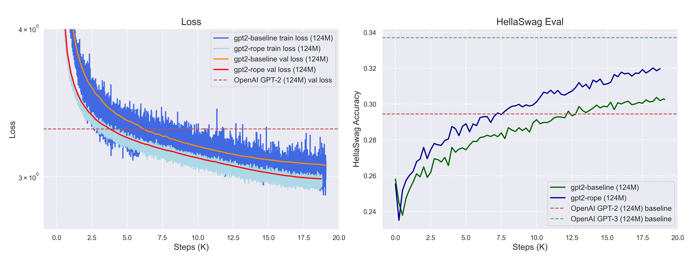

# Building From Scratch

A hands-on repo where I build language models and related concepts from first principles, step by step. The main purpose is to learn and understand the inner workings of different components and improvements in transformers.

## Repo structure
```
building-from-scratch/
├── basic-gpt/      # Character-level GPT built incrementally; notebooks, scripts
├── gpt-2/          # GPT‑2 (124M) reproduction + improvements; training runs, notes
├── bpe/            # BPE tokenizer from scratch; training/encoding optimizations, custom tokenizers
├── llm-inference/  # LLM inference from scratch; sampling strategies, KV cache, speculative decoding
├── sft/            # Supervised fine-tuning from scratch; reasoning & instruction SFT experiments
└── grpo/           # GRPO from scratch; Qwen2.5-Math-1.5B with verifiable rewards + ablation studies
```

## Basic-GPT
It contains a character-level GPT built incrementally, following Karpathy’s ["Let’s build GPT: from scratch"](https://www.youtube.com/watch?v=kCc8FmEb1nY). The final scaled model reaches ~**1.48** validation loss.
<p align="center">
  
</p>

[Read more ->](basic-gpt/Readme.md)

## GPT-2
I reimplemented GPT‑2 (124M) code from scratch and then further added improvements such as RoPE, global data shuffling, and tuned the learning rate schedule. In my best run (`gpt2-rope`), I achieved a **validation loss 2.987** and **HellaSwag accuracy 0.320**, surpassing the original GPT‑2 baseline quite significantly.

<p align="center">
  
</p>

| Experiment | Min Validation Loss | Max HellaSwag Acc | Description |
|------------|---------------------|-------------------|-------------|
| gpt2-baseline | 3.065753 | 0.303724 | Original GPT-2 architecture |
| gpt2-periodicity-fix | 3.063873 | 0.305517 | Fixed data loading periodicity |
| gpt2-lr-inc | 3.021046 | 0.315475 | Increased learning rate by 3x and reduced warmup steps |
| gpt2-global-datafix | 3.004503 | 0.316869 | Used global shuffling with better indexing |
| gpt2-rope | **2.987392** | **0.320155** | Replaced learned embeddings with RoPE |

[Read more ->](gpt-2/Readme.md)

## BPE Tokenizer
I implemented Byte Pair Encoding (BPE) training and inference from scratch. I started with a naive baseline, progressively optimized training (**~50x faster**) and encoding (**3.7x faster with Rust**), then trained custom 16K tokenizers on TinyStoriesV2 (~2.6GB) and FineWeb (~3.3GB) datasets. I also tried to evaluate their impact on GPT-2 pre-training.

<p align="center">
  
</p>

[Read more ->](bpe/Readme.md)

## LLM Inference
I built LLM inference from scratch implementing:
- sampling strategies (greedy, multinomial, top-k, top-p)
- penalty controls (presence, frequency, repetition)
- latency optimizations (FP16/BF16, KV cache, variable-length batching, speculative decoding)

| Optimization | Best Speedup (float32) | Best Speedup (float16) |
|--------------|------------------------|------------------------|
| KV cache | **2.76×** (gpt2-large, 800 tokens) | **1.48×** (gpt2-xl, 800 tokens) |
| Speculative decoding | **1.63×** (draft: gpt2 -> target: gpt2-xl, gamma=5) | **1.31×** (draft: gpt2 -> target: gpt2-xl, gamma=3) |

[Read more ->](llm-inference/Readme.md)

## Supervised Fine-Tuning (SFT)
I implemented Supervised Fine-Tuning from scratch, running two categories of SFT experiments:

**Reasoning SFT** (Qwen2.5-Math-1.5B): Fine-tuned on math reasoning traces to improve problem solving.


**Instruction SFT** (Llama-3.1-8B): Fine-tuned on UltraChat-200K + SafetyLlama for general instruction following.


[Read more ->](sft/Readme.md)

## GRPO
I implemented Group Relative Policy Optimization (GRPO) from scratch and trained [Qwen2.5-Math-1.5B](https://huggingface.co/Qwen/Qwen2.5-Math-1.5B) with verifiable math rewards, reaching **~75% reward accuracy** on MATH validation (up from ~3% base model). Beyond just getting the implementation working, most importantly I ran a series of ablation studies to build intuition on what actually matters in GRPO training: learning rate, baseline subtraction, length normalization, std dev normalization, off-policy training, prompt template, and SFT checkpoint initialization.


[Read more ->](grpo/Readme.md)