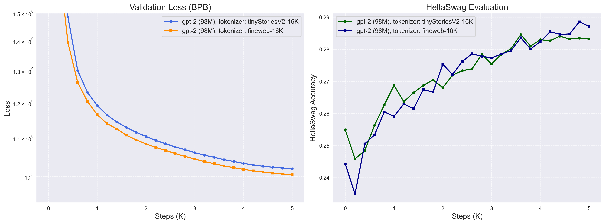

# BPE Tokenizer implementation and much more...

This is my implementation of Byte Pair Encoding (BPE) training and inference for text tokenization, following Andrej Karpathy's ["Let's build the GPT Tokenizer"](https://www.youtube.com/watch?v=zduSFxRajkE) video tutorial. I started with a naive baseline implementation similar to the one in the tutorial and progressively optimized it for better and faster training and encoding of large datasets. I also trained custom tokenizers on large datasets, evaluated their performance, and (tried to) analyze how they impact GPT-2 pre-training .

## Table of Contents

- [TL;DR](#tldr)
- [Optimizing Training Speed](#optimizing-training-speed)
- [Optimizing Encoding Speed](#optimizing-encoding-speed)
- [Writing the Rust Encoder Implementation](#writing-the-rust-encoder-implementation)
- [Experiment: Tokenizer effect on GPT-2 training](#experiment-tokenizer-effect-on-gpt-2-training)
- [How to go through the implementation](#how-to-go-through-the-implementation)
- [Repository structure](#repository-structure)

## TL;DR

#### 1. Basic BPE Implementation with GPT-2 Regex Pattern Handling

Implemented core BPE training algorithm with byte-pair merging, GPT-2 regex-based pre-tokenization to prevent merges across natural text boundaries, and special token handling.

#### 2. Training Speed Optimization: 50x Faster 

Identified and optimized bottlenecks in the training process:

**Faster Merge Operations**

| Metric | Baseline | Optimized | Speedup |
|--------|----------|-----------|---------|
| Total training time | 117s | 2.4s | **~50x** |
| Per-merge time | ~5-6s | ~0.017s | **~300x** |

**Parallel Pre-tokenization**

| Approach | Pre-tokenization Time | Speedup |
|----------|---------------------|---------|
| Sequential | 212.8s | 1.0x |
| Parallel (7 cores) | 35.2s | **~6x** |

<sub>*Test dataset: TinyStoriesV2-GPT4-valid.txt (22.5 MB, 6.09M tokens)*</sub>

#### 3. Inference Speed Optimization: 3.7x Faster

Progressive optimization from Python baseline to Rust implementation:
- **Python optimization**: Replaced frequency counting with set-based pair collection → 9% faster
- **Rust implementation**: Rewrote encode/decode in Rust with PyO3 bindings → 3.7x faster

| Implementation | Encoding Time | Throughput | Speedup |
|----------------|---------------|------------|---------|
| Python (baseline) | 21.28s | 286K tok/s | 1.0x |
| Python (optimized) | 19.48s | 313K tok/s | 1.09x |
| **Rust** | **5.26s** | **1.16M tok/s** | **3.70x** |

<sub>*Test dataset: TinyStoriesV2-GPT4-valid.txt (22.5 MB, 6.09M tokens)*</sub>


#### 4. Custom Tokenizer Training and GPT-2 Evaluation

Trained custom 16K tokenizers on TinyStoriesV2 (~2.6GB) and FineWeb (~3.3GB) datasets.

#### Compression Ratio Analysis

**Test 1: Web Text (FineWeb, 22.56 MB)**

| Tokenizer | Training Data | Vocab | Bytes/Token |
|-----------|---------------|-------|-------------|
| GPT-2 | WebText | 50K | **4.64** |
| fineweb-16K | FineWeb (~3.3GB) | 16K | **4.33** |
| tinystoriesv2-16K | TinyStoriesV2 (~2.6GB) | 16K | 3.54 |

<sub>*Using a much diverse web dataset like FineWeb is able to achieve a better compression ratio compared to TinyStoriesV2 with similar 16K vocabulary size.*</sub>

**Test 2: Story Text (TinyStories, 21.46 MB)**

| Tokenizer | Training Data | Vocab | Bytes/Token |
|-----------|---------------|-------|-------------|
| tinystoriesv2-16K | TinyStories | 16K | **4.13** |
| tinystoriesv2-8K | TinyStories | 8K | **4.11** |
| GPT-2 | WebText | 50K | 4.07 |

<sub>*Domain-specific 8K/16K tokenizers beat general 50K GPT-2 on target domain. Not sure how useful in this case but gives hints at maybe we can use domain-specific tokenizers for better compression and hopefully better performance.*</sub>

#### GPT-2 Training Evaluation

Trained GPT-2 models to compare tokenizer impact on pre-training performance:



**Results**: FineWeb tokenizer showed marginally better performance after 5K steps (~2.5B tokens), validating that the custom tokenizer pipeline works correctly end-to-end. Though, would have been interesting to see how it would perform with more steps or larger GPT-2 model.


> **Note on Hardware**: All tokenizer training and optimization experiments were conducted on a **MacBook M3 Pro Max with 36GB RAM**. GPT-2 pre-training was performed on a single **80GB GPU instance**.

---


## Optimizing Training Speed

When I first implemented the basic BPE training algorithm, it worked correctly but was painfully slow. Running the baseline implementation with just 20 merges on the validation dataset took **117 seconds** (~2 minutes), with **each merge taking ~5-6 seconds**. This seemed far too slow—imagine training a production tokenizer with >10K merges on a dataset of 100M chunks!

### Choosing a Realistic Test Case
- To understand where the performance bottlenecks were, I needed a realistic test case, so I chose the **TinyStoriesV2-GPT4-valid dataset** (~5.5M text chunks) from Hugging Face—large enough to expose real performance issues but small enough to iterate quickly during optimization.

### Profiling the Baseline Implementation

To identify the specific bottleneck functions, I profiled the code using Python's `cProfile`.

The profile analysis revealed that three functions consumed >80% of total runtime:
- `get_freqs()`: Computing pair frequencies across all 5.5M sequences
- `merge()`: Applying the chosen merge across all 5.5M sequences  
- `len()`: Repeated length calculations during frequency computation

The fundamental problem was clear: **we were reprocessing all 5.5 million text chunks during every single merge operation**, even though most chunks in any corpus are duplicates.


### The Key Optimization: Frequency-Weighted Merging with Unique Pre-tokens

The breakthrough insight was simple but powerful: instead of operating on all text chunks repeatedly, collapse duplicate chunks into unique pre-token tuples with their occurrence frequencies (commit `c156d5d`).

- After regex-based pre-tokenization, convert all text chunks to tuples of bytes and collect unique tuples with their frequencies. This reduced the working dataset from ~5.5M chunks to just **~13K unique pre-tokens**, a **>400x reduction** in data size.

- Instead of counting pairs across all 5.5M chunks, count only across the 13K unique tuples. Multiply each pair occurrence by the tuple's frequency to get accurate total counts. This preserves exact correctness while dramatically reducing computation.

- Apply merge operations only to unique id sequences and propagate the frequency information through the merge, avoiding redundant merging of duplicate sequences.

**Performance Results:**

Benchmarked on TinyStoriesV2-GPT4-valid.txt (~5.5M chunks):

| Metric | Baseline | Optimized | Speedup |
|--------|----------|-----------|---------|
| Text chunks processed | ~5.5M | ~13K unique | **420x reduction** |
| Total training time | 117s (1.96 min) | 2.4s (0.04 min) | **~50x faster** |
| Per-merge time | ~5-6 seconds | ~0.017 seconds | **~300x faster** |

### Scaling to Larger Datasets: Parallel Pre-tokenization

With the merge operations now optimized, I tested the implementation on the full TinyStoriesV2-GPT4-train.txt dataset (~544M chunks, ~2M documents). This revealed a new bottleneck: pre-tokenization itself (commit `0e8e3fd`).

The pre-tokenization (regex splitting + frequency counting) took over **212 seconds** (3.5 minutes) for the 544M chunks. While this was acceptable for one training run, it would scale poorly for even larger corpora like FineWeb (10B+ tokens). **The solution was to parallelize the pre-tokenization stage.**

**Performance Results:**

Benchmarked on TinyStoriesV2-GPT4-train.txt (~544M chunks):

| Approach | Pre-tokenization Time | Speedup |
|----------|---------------------|---------|
| Sequential | 212.8 seconds | 1.0x (baseline) |
| Parallel (7 processes) | 35.2 seconds | **~6x faster** |

---

## Optimizing Encoding Speed

I wanted to optimize the encoding speed since it happens on every inference call, and if we want to encode tens or hundreds of GB of text, performance matters. The first-level optimization I implemented was to replace the frequency dictionary approach with `set(zip(ids, ids[1:]))` to collect unique pairs without counting. The key insight here is that we don't actually need frequency counts—we only need to identify which unique pairs exist to find the one with the minimum merge index.

You can find see the code changes in `16b25e4` commit.

**Performance Results:**

Benchmarked on TinyStoriesV2-GPT4-valid.txt (22.5 MB, 6.09M tokens):

| Metric | Baseline | Optimized | Improvement |
|--------|----------|-----------|-------------|
| Encoding time | 21.28s | 19.48s | **~9% faster** |
| Throughput (tokens/sec) | 286,301 | 312,748 | **+9.2%** |
| Throughput (MB/sec) | 1.01 MB/s | 1.10 MB/s | **+8.9%** |

- While the 9% speedup may seem modest, it's still a decent improvement given just a 3-line code change!
- However, even with this improvement, Python encoding was still only ~1.1 MB/s—suggesting that further gains would require moving beyond Python.

---

## Writing the Rust Encoder Implementation

After trying Python-level optimizations, encoding throughput was still only ~1.1 MB/s (313K tokens/sec), which I thought would be a bottleneck for high-throughput inference scenarios. To achieve further performance gains, I implemented the BPE encode/decode functions in Rust.

Since I'm not proficient in Rust, I used an AI-assisted development approach and vibe-coded ;-). You can read more about my approach [here](encode_rs/README.md).

**Performance Results:**

Benchmarked on TinyStoriesV2 validation set (21.5 MB, 22.4M characters):

| Implementation | Time | Throughput | Tokens/sec | Speedup |
|----------------|------|------------|------------|---------|
| Python (baseline) | 21.3s | 1.01 MB/s | 286K | 1.0x |
| Python (optimized) | 19.4s | 1.16 MB/s | 313K | 1.09x |
| **Rust (via Python)** | **5.1s** | **4.40 MB/s** | **1.16M** | **3.79x** |

**Note:**
- I went ahead only with encode/decode implementation since training is a one-time cost
- The encode/decode implementation is fully compatible with the Python trainer and reads the same `.model` files produced by the Python trainer
- It has the same API as Python version, can be imported as `from bpe_encode_rust import BpeTokenizer` and used as `BpeTokenizer`. I used Rust python bindings (via PyO3) to make it usable from Python
- You can find the complete implementation details, setup instructions, and benchmarks in the [encode_rs](encode_rs) directory.

---

## Experiment: Tokenizer effect on GPT-2 training

While compression ratios provide a useful metric for tokenizer quality, I actually wanted to see whether using different custom tokenizers would impact the training performance. Thus, I conducted an experiment to train GPT-2 models on data encoded with custom tokenizers and track validation loss and HellaSwag accuracy for objective comparison.

### Custom-trained tokenizers

My two custom-trained tokenizers are:

1. [**TinyStoriesV2 Tokenizer**](data/tinystoriesv2-gpt4-train-16384.model): Trained on TinyStories V2 dataset (~2.6 GB of children's story text)
2. [**FineWeb Tokenizer**](data/fineweb-000_00003-gpt4-train-16384.model): Trained on a subset of FineWeb dataset (~3.3 GB of diverse web text)

> Note: 
> - I have made sure that FineWeb tokenizer is trained on different dataset than the one that will be used for training and validation of GPT-2 pre-training.
> - Both tokenizers used 16K vocabulary size to isolate the vocabulary size effects.

### Training Configuration

- **Training Duration**: 5K steps (~2.5B tokens, not full FineWeb—enough to observe trends without excessive compute)
- **Model**: GPT-2 124M parameter architecture (with 16K vocabulary size the model size reduces to ~98M)
- **Sequence Length**: 1024
- Other parameters are the same as the original GPT-2 training script you can find in [train_gpt2.py](gpt-2/train_gpt2.py).

### Preparing Data for Training

- Ensure that both your training and validation datasets are correctly encoded using the custom tokenizer you're evaluating, **not** the original GPT-2 tokenizer.

- I had FineWeb training data that was already tokenized using the original GPT-2 tokenizer, I re-encoded it using the custom BPE tokenizers (TinyStoriesV2-16K and FineWeb-16K) and created new data shards for each custom tokenizer.
- You can find the data re-encoding scripts in the `helper_scripts/` folder: [fineweb-encode-bpe-modal.py](helper_scripts/fineweb-encode-bpe-modal.py) - re-encodes large datasets using custom tokenizers on Modal infra.

### Evaluation Criteria

To ensure fair comparison between the two custom tokenizers (even though they share the same vocab size), I used the following metrics:

1. **Bits-Per-Byte (BPB) Loss** — Primary Metric
   - Converts validation loss to bits-per-byte, measuring model quality normalized by actual text length in bytes rather than token count
   - Ensures tokenizers with different compression rates are compared on equal ground, the comparison becomes tokenizer-agnostic.

2. **HellaSwag Accuracy with Length Normalization**
   - Uses length-normalized likelihood to select the most probable ending
   - Prevents bias where tokenizers that produce more tokens for the same text would accumulate higher total loss and appear worse even if modeling equally well

### Results


**Key Observations:**

1. Custom tokenizers and training pipeline work correctly (validation of implementation):
    - Consistent decrease in validation loss throughout training
    - Steady improvement in HellaSwag accuracy
    - Smooth, stable training curves with no divergence or instabilities
    - **The custom tokenizer pipeline from training → re-encoding → GPT-2 training is working as intended.**

2. Slight improvement with FineWeb tokenizer, but inconclusive:
   - The FineWeb tokenizer shows marginally better performance on both metrics:
     - Validation Loss (BPB): FineWeb achieves ~1.005 BPB vs TinyStoriesV2's ~1.02 BPB (~1% improvement)
     - HellaSwag Accuracy: FineWeb reaches ~28.7% vs TinyStoriesV2's ~28.3% (~0.4% improvement)
   - However, these differences are quite small and could be attributed to several factors:
     - Model size is relatively small (~98M parameters with 16K vocab)
     - Similar improvements could likely be achieved by tuning hyperparameters (e.g., learning rate decay schedule)
     - Training duration may be insufficient—note how TinyStoriesV2's HellaSwag accuracy appears to plateau around 3-4K steps while FineWeb continues to improve slightly, suggesting longer training might reveal larger differences
   - **The improvements are encouraging but not conclusive. Maybe I need to train for longer or use a larger model to see more significant differences.**


## How to go through the implementation

- If you want to understand how I approached the implementation and optimizations, I recommend exploring the commit history. 
- Each commit (most of the time!) represents an incremental step in the development process—adding new features, identifying bottlenecks, implementing optimizations, and running experiments. 
- By going through the commits sequentially, you'll see how the implementation evolved from a simple baseline to an optimized training and inference scripts

### Commit Summary

| Commit ID | Title | Description |
|-----------|-------|-------------|
| `c014e47` | bpe-simple-train | Basic BPE training algorithm with byte-pair merging |
| `80feeb9` | bpe-encode-decode | Added encode/decode methods with iterative merge application |
| `e390efb` | bpe-regex-patterns | Regex-based pre-tokenization using GPT-2's pattern |
| `a865436` | bpe-special-tokens | Special token handling in encode with multiple modes |
| `9002eb1` | bpe-save-load | Tokenizer persistence with save/load methods |
| `c55356b` | bpe-special-tokens-training | Exclude special tokens from BPE merges during training |
| `2dd2d40` | bpe-profiling | Added timing and profiling to identify bottlenecks |
| `c156d5d` | bpe-optimization | Frequency-weighted merging with unique pre-tokens (~50x speedup) |
| `0e8e3fd` | bpe-parallel-pre-tokenization | Parallel pre-tokenization using multiprocessing (~6x speedup) |
| `16b25e4` | bpe-encode-optimization | Set-based pair collection for encoding (~9% speedup) |
| `7355f05` | bpe-rust-encode | Rust implementation via PyO3 (~3.7x speedup) |
| `85c386e` | bpe-modal-scripts | `Modal` scripts for cloud bpe training and dataset encoding using custom BPE tokenizers |
| `5b47b6d` | bpe-compression-analysis | Compression analysis across data domains and vocab sizes |
| `4796c3f` | bpe-gpt2-training | Modified GPT-2 training for custom tokenizer training and improved evaluation metrics |

### Implementation Details

#### 1. `bpe-simple-train`: Basic BPE implementation
**Commit**: `c014e47`

- Follow Andrej Karpathy's video tutorial to implement the core BPE training algorithm that iteratively merges the most frequent byte pairs in a corpus.  Converts text to UTF-8 bytes, counts pair frequencies, and builds a vocabulary of merge rules. 
> Note: it does not yet handle regex patterns or special tokens.

#### 2. `bpe-encode-decode`: Added encode and decode functions
**Commit**: `80feeb9`

- Implemented `encode()` to convert text to token IDs and `decode()` to convert tokens back to text.
- Applies learned merge rules iteratively during encoding by finding the pair with the minimum merge index.

#### 3. `bpe-regex-patterns`: Added regex pattern handling
**Commit**: `e390efb`

- Added regex-based pre-tokenization using GPT-2's pattern from tiktoken. 
- Splits text into chunks (words, numbers, punctuation) before applying BPE, preventing merges across natural boundaries. 
- Modified training and encoding to operate on regex-split chunks rather than raw text.

#### 4. `bpe-special-tokens`: Added special token handling
**Commit**: `a865436`

- Implemented special token handling in the `encode()` method with three modes: "all" (allow all), "none" (disallow silently), and "none_raise" (raise error if found). It is sort of similar to tiktoken. 
- Special tokens like `<|endoftext|>` are encoded directly without applying BPE merges, preserving their semantic meaning.

#### 5. `bpe-save-load`: Added tokenizer persistence
**Commit**: `9002eb1`

- Implemented `save()` and `load()` methods to persist trained tokenizers to disk.
- Stores the merge rules, special tokens, and regex pattern in a JSON file with `.model` extension, enabling reuse without retraining.

#### 6. `bpe-special-tokens-training`: Improved special tokens handling in training
**Commit**: `c55356b`

- Modified training to properly exclude special tokens from regex splitting and BPE merges. 
- Special tokens are registered in the vocabulary but never participate in merge operations, ensuring they remain atomic tokens throughout training and inference.

#### 7. `bpe-profiling`: Added profiling and timing metrics
**Commit**: `2dd2d40`

- Added timing and profiling to identify bottlenecks, I used `cProfile` on TinyStoriesV2-valid (~5.5M chunks). 
- I found that training 20 merges took 117 seconds (~5-6s per merge), with `get_freqs()` and `merge()` consuming >80% of runtime—clearly impractical for training with large datasets.

#### 8. `bpe-optimization`: Frequency-weighted merging with unique pre-tokens
**Commit**: `c156d5d`

- Implemented the key optimization: collapse duplicate text chunks into unique pre-token tuples with frequencies. 
- Instead of processing 5.5M chunks per merge, operate on only 13K unique tuples (420x reduction). 
- Multiply pair counts by tuple frequencies to maintain correctness while dramatically reducing computation.

| Metric | Baseline | Optimized | Speedup |
|--------|----------|-----------|---------|
| Total training time | 117s | 2.4s | **~50x** |
| Per-merge time | ~5-6s | ~0.017s | **~300x** |
> Speedup is proportional to corpus duplication rate; it maintains exact correctness.

#### 9. `bpe-parallel-pre-tokenization`: Parallel pre-tokenization
**Commit**: `0e8e3fd`

- After optimizing merges, pre-tokenization became the bottleneck on large datasets (212s for 544M chunks). 
- Implemented parallel pre-tokenization using multiprocessing: split file at document boundaries, process chunks independently, then aggregate frequency counts. 

| Approach | Pre-tokenization Time | Speedup |
|----------|---------------------|---------|
| Sequential | 212.8s | 1.0x |
| Parallel (7 cores) | 35.2s | **~6x** |

*Near-linear scaling with CPU cores; ready for billion-token datasets.*

#### 10. `bpe-encode-optimization`: Set-based pair collection for encoding
**Commit**: `16b25e4`

Optimized encoding by replacing `get_freqs(ids)` with `set(zip(ids, ids[1:]))` to collect unique pairs. 
- During encoding, we only need to identify which pairs exist, not count their frequencies. 
- This avoids unnecessary counting and reduces memory allocations.

| Metric | Baseline | Optimized | Improvement |
|--------|----------|-----------|-------------|
| Encoding time (22.5 MB) | 21.28s | 19.48s | **~9% faster** |
| Throughput | 286K tokens/s | 313K tokens/s | **+9.2%** |
*Modest but important: encoding happens on every inference call.*

#### 11. `bpe-rust-encode`: Rust implementation for inference
**Commit**: `7355f05`

- Implemented encode/decode in Rust (via PyO3) for further performance gains. 
- Used AI-assisted "vibe-coding" to translate Python logic to Rust, added Python bindings with maturin, and verified correctness. 
- Reads the same `.model` files as Python trainer—drop-in replacement for inference.

| Implementation | Encoding Time | Throughput | Speedup |
|----------------|---------------|------------|---------|
| Python (baseline) | 21.28s | 286K tok/s | 1.0x |
| Python (optimized) | 19.48s | 313K tok/s | 1.09x |
| **Rust** | **5.26s** | **1.16M tok/s** | **3.70x** |

#### 12. `bpe-modal-scripts`: Cloud training and dataset re-encoding
**Commit**: `85c386e`

- Created Modal scripts for cloud-based workflows: 
    - `train-bpe-modal.py` trains tokenizers on large datasets with automatic data download, parallel processing, and persistent storage. 
    - `fineweb-encode-bpe-modal.py` re-encodes GPT-2 tokenized datasets using custom tokenizers—decodes shards to text, re-encodes with custom BPE, and creates new 100M-token shards.
- These scripts are useful for training and re-encoding large datasets on Modal cloud infrastructure especially

#### 13. `bpe-compression-analysis`: Compression analysis across domains
**Commit**: `5b47b6d`

- Trained four tokenizers (8K, 16K on TinyStoriesV2; 16K on part of FineWeb dataset approximately 3.3GB) to analyze how vocab size and training domain affect compression. 
- Evaluated on two test sets: web text (FineWeb) and story text (TinyStories).

**Test 1: Web Text (FineWeb, 22.56 MB)**

| Tokenizer | Training Data | Vocab | Bytes/Token |
|-----------|---------------|-------|-------------|
| GPT-2 | WebText | 50K | **4.64** |
| fineweb-16K | FineWeb (~3.3GB) | 16K | **4.33** |
| tinystoriesv2-16K | TinyStoriesV2 (~2.6GB) | 16K | 3.54 |

*Using a much diverse dataset like FineWeb is able to achieve a better compression ratio compared to TinyStoriesV2 even wit around 16K smaller vocab.*

**Test 2: Story Text (TinyStories, 21.46 MB)**

| Tokenizer | Training Data | Vocab | Bytes/Token |
|-----------|---------------|-------|-------------|
| tinystoriesv2-16K | TinyStories | 16K | **4.13** |
| tinystoriesv2-8K | TinyStories | 8K | **4.11** |
| GPT-2 | WebText | 50K | 4.07 |

*Domain-specific 8K/16K tokenizers beat general 50K GPT-2 on target domain. Not sure how useful in this case but gives hints at maybe we can use domain-specific tokenizers for better compression and hopefully better performance.*

#### 14. `bpe-gpt2-training`: GPT-2 training for tokenizer evaluation
**Commit**: `4796c3f`

After building and optimizing custom BPE tokenizers, the next critical step was to evaluate their effectiveness by training actual GPT-2 models. To enable fair comparison between different tokenizers (custom BPE vs tiktoken GPT-2), I modified the GPT-2 training script with several key changes.


## Repository structure

```
bpe/
├── bpe.py                      # Core BPE tokenizer implementation (training + inference)
├── train_bpe.py                # Script for training custom BPE tokenizers
├── train_gpt2.py               # Modified GPT-2 training script for custom tokenizers
│
├── lecture_notes.md            # Detailed notes from Karpathy's video
│
├── encode_rs/                  # Rust implementation for fast encoding
│   └── README.md               # Rust implementation documentation
│
├── helper_scripts/
│   ├── train-bpe-modal.py           # Running BPE training on Modal infra
│   ├── fineweb-encode-bpe-modal.py  # Re-encode datasets using custom tokenizers
│   ├── benchmark_encode.sh          # Benchmarking script for encoding speed
│   ├── benchmark_encoding.py        # Python benchmarking utilities
│   ├── benchmark_rust_vs_python.py  # Compare Rust vs Python performance
│   ├── calculate_compression_ratios.ipynb  # Analyze tokenizer compression ratios
│   ├── make_plots.ipynb             # Generate comparison plots for custom BPE tokenizer GPT-2 training
│   ├── model.py                     # GPT-2 model for evaluation
│   └── hellaswag.py                 # HellaSwag evaluation implementation
│
├── data/
│   ├── input.txt                                 # Sample text for debugging
│   ├── tinystoriesv2-gpt4-train-16384.model      # Custom 16K tokenizer trained on TinyStoriesV2
│   ├── tinystoriesv2-gpt4-train-16384.vocab      # corresponding vocabulary file
│   ├── fineweb-000_00003-gpt4-train-16384.model  # Custom FineWeb 16K tokenizer trained on FineWeb
│   └── fineweb-000_00003-gpt4-train-16384.vocab  # corresponding vocabulary file
│
├── images/                     # Image for Readme and notes
│
├── logs/                       # Training and profiling logs
│
└── Readme.md                   # This file
```