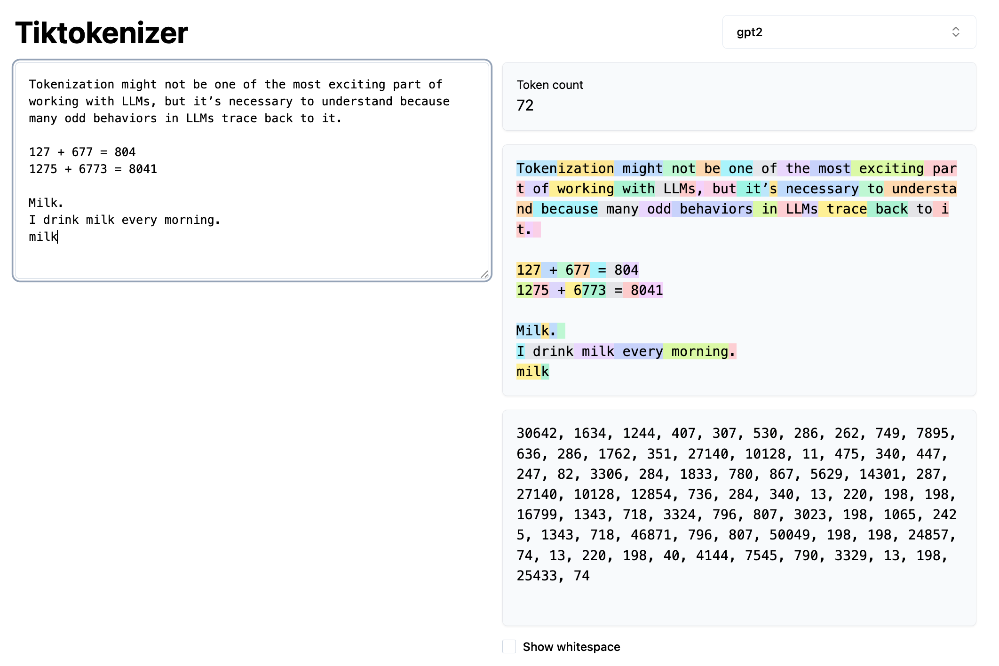
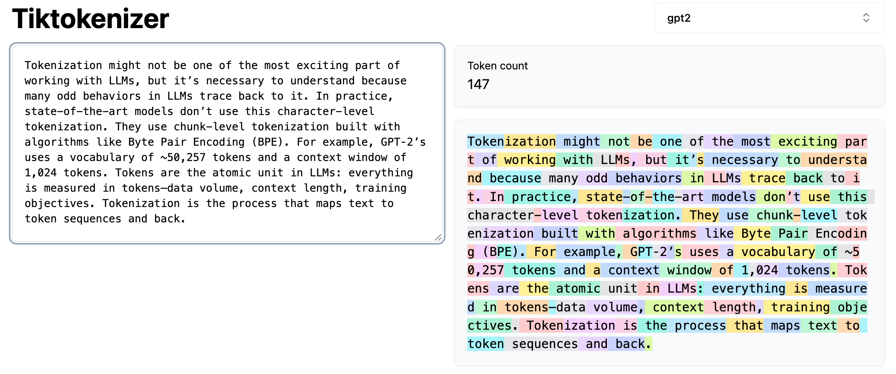
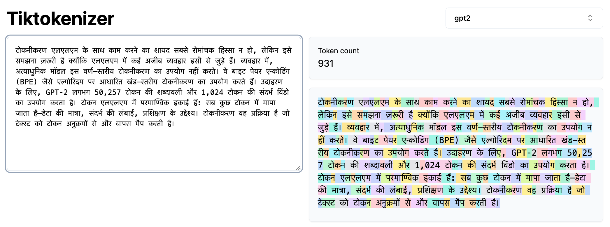
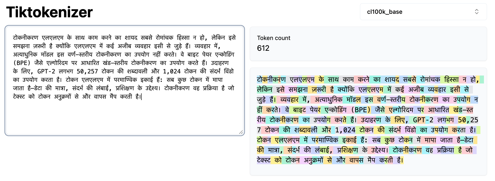
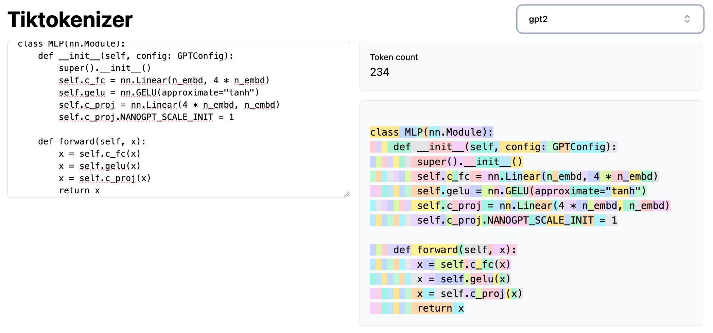
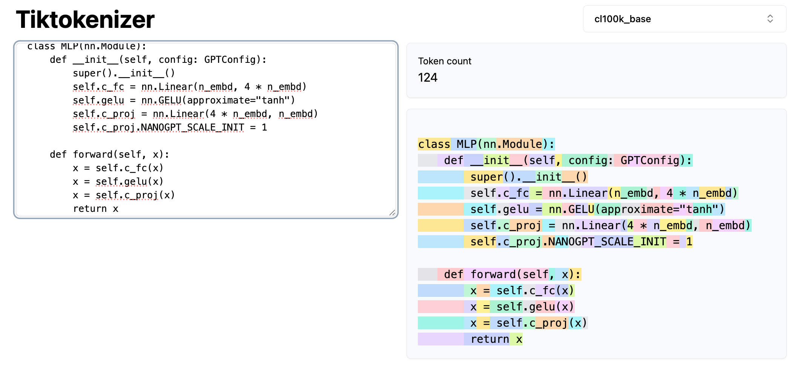
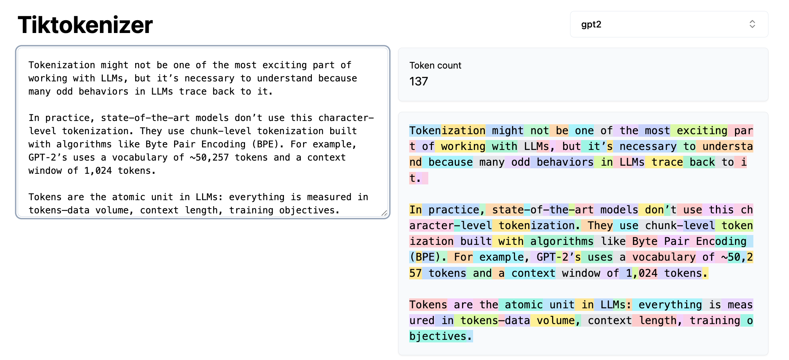
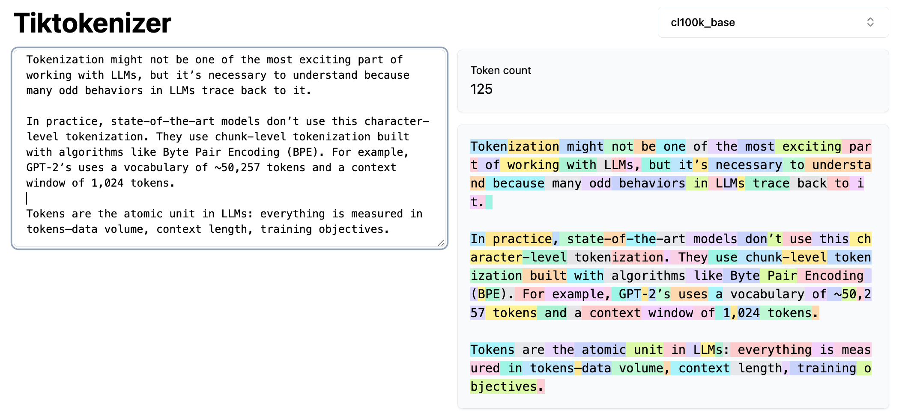

# Let's build the GPT Tokenizer

## Links
- [Youtube Video Link](https://www.youtube.com/watch?v=zduSFxRajkE)

## Introduction
- Tokenization might not be one of the most exciting part of working with LLMs, but it’s necessary to understand because many odd behaviors in LLMs trace back to it. 
- In “Let’s Build GPT from Scratch”, Karpathy built a very simple tokenizer (character-level tokenizer) where he mapped each character to an integer token ID, then looked up embeddings from a 65-row table to feed the Transformer. Basically, each token ID indexes a row vector—trainable parameters learned by backprop—which feeds into the Transformer.
- In practice, state-of-the-art models don’t use this character-level tokenization. They use chunk-level tokenization built with algorithms like Byte Pair Encoding (BPE). For example, GPT‑2’s uses a vocabulary of ~50,257 tokens and a context window of 1,024 tokens.
- Tokens are the atomic unit in LLMs: everything is measured in tokens—data volume, context length, training objectives.
- Tokenization is the process that maps text to token sequences and back.
- As mentioned before, many of the issues with LLMs trace back to tokenization. For example all the below issues are related to tokenization:
  - Spelling/character-based tasks can be hard because words may be single multi-character tokens.
  - Simple string operations can be brittle due to arbitrary token boundaries.
  - Non‑English text often expands into more tokens, reducing effective context and hurting performance.
  - Arithmetic can suffer because numbers tokenize inconsistently (sometimes single-token, sometimes split).
  - Early GPT‑2 struggled more with Python in part due to whitespace/tokenization behavior.
  - Trailing whitespace can cause warnings or off‑distribution prompts.
  - Specific strings (e.g., “solidgoldMagikarp”) can map to rare/untrained tokens and trigger bizarre outputs.
  - Token economy matters; formats like YAML may be more token‑efficient than JSON for the same structure.
- We should never brush off tokenization—it’s central to model behavior.

## Tiktokenizer App
- App Link: https://tiktokenizer.vercel.app/

- You can use the tiktokenizer app to visualize how different tokenizers (e.g., GPT‑2 vs `cl100k_base`) split text and count tokens in real time.
- Note, spaces are often part of token chunks; counts include them. Another point to note is how the numbers are tokenized arbitrarily (e.g., 127 may be one token, 677 and 804 may split). This complicates arithmetic for LLMs.
- The same word can tokenize differently at sentence start vs after a leading space; lowercase/uppercase map to different token IDs. The model must learn their equivalence from data.

- Non-english text typically use more tokens than equivalent English, effectively “stretching” content within a fixed context window, partly due to tokenizer training skewed toward English. This reduces the effective context and hurts performance on non-english text.

  
  

  
  

- See the number of tokens for the same python code in GPT‑2 and GPT‑4. GPT-2 tokenizer is more wasteful than GPT-4 tokenizer. This is one of the reasons why GPT-2 is not very good with python. OpenAI made a deliberate choice to improve the python or space tokenization for GPT-4. For example, GPT-4 tokenizer (`cl100k_base`) groups a lot more space into a single token, making Python code much denser and improving coding performance due in part to the tokenizer design, not just the model.

  
  

- Overall, GPT-4 tokenizer is more efficient than GPT-2 tokenizer even for normal english text. However, just increasing the number of tokens is not strictly better infinitely because as you increase the number of tokens now your embedding table is getting a lot larger. Moreover, at prediction time, you are trying to predict the next token and there's the soft Max there and that grows as well. Thus, we need to have a just right number of tokens in your vocabulary where everything is appropriately dense and still fairly efficient.

  
  

## Unicode
- We need a way to convert any string (English, Hindi, emojis) into a sequence of integers to feed into the Transformer's embedding table.
- For that, first we need to understand how are strings (text) represented. In Python, strings are sequences of Unicode code points.
- Here, [Unicode](https://en.wikipedia.org/wiki/Unicode) is a standard defining ~150,000 characters across all the world's scripts. We can get the integer code point for any character using Python's `ord()` function.
- **Why not just use unicode code points as tokens?**:
  - The vocabulary would be very large (~150,000), which makes the embedding and final output layers huge.
  - More critically, the Unicode standard is constantly evolving. A model trained on one version would be incompatible with text using characters from a newer version. It's not a stable, fixed vocabulary.

## UTF-8 and other unicode byte encodings
- Encodings like UTF-8, UTF-16, and UTF-32 are standards for translating Unicode code points into binary byte streams.
- UTF-8 is an encoding that maps code points to a 1–4-byte stream (sequence of bytes). It's the dominant standard on the internet. It’s a variable-length encoding (1-4 bytes per character) and, crucially, is backward-compatible with ASCII. We can convert a Python string to its UTF-8 byte representation using `.encode('utf8')`.
- **Why not use raw UTF-8 bytes as tokens?**:
  - The vocabulary would be tiny (just 256 possible bytes).
  - This would make our token sequences extremely long, as every single byte becomes a token.
  - Long sequences are inefficient and quickly exhaust the Transformer's fixed context length, meaning the model can't see very far back in the text.
- We want to start with the raw UTF-8 byte stream but compress it. We need a method that lets us create a larger, tunable vocabulary to make sequences shorter and denser.
- This is exactly the problem that the Byte Pair Encoding (BPE) algorithm solves. It allows us to compress these byte sequences effectively.
- Links to read more on UTF: 
    - [A programmer's intro to Unicode](https://www.reedbeta.com/blog/programmers-intro-to-unicode/)
    - [UTF-8 Everywhere](https://utf8everywhere.org/)
- Note, we would love to get rid of tokenization entirely and just feed raw byte streams directly into LLMs. There are papers like [MEGABYTE](https://arxiv.org/abs/2305.07185) that are exploring this. This "tokenization-free" approach requires modifying the standard Transformer architecture .While promising, these type of methods are not yet proven at a large enough scale or widely adopted in production models.
