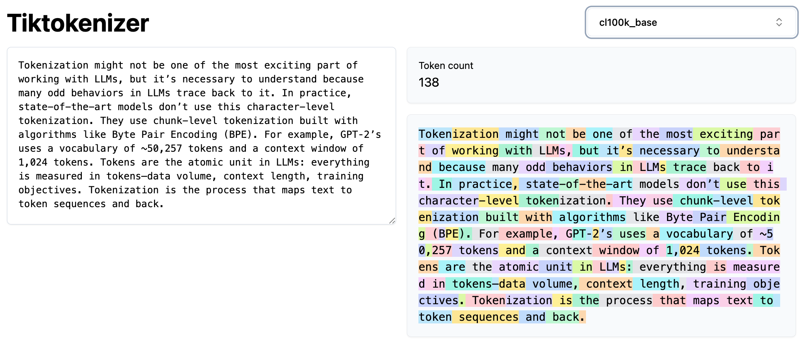

# Let's build the GPT Tokenizer


## Links
- [Youtube Video Link](https://www.youtube.com/watch?v=zduSFxRajkE)

## Introduction
- Tokenization might not be one of the most exciting part of working with LLMs, but it’s necessary to understand because many odd behaviors in LLMs trace back to it. 
- In “Let’s Build GPT from Scratch”, Karpathy built a very simple tokenizer (character-level tokenizer) where he mapped each character to an integer token ID, then looked up embeddings from a 65-row table to feed the Transformer. Basically, each token ID indexes a row vector—trainable parameters learned by backprop—which feeds into the Transformer.
- In practice, state-of-the-art models don’t use this character-level tokenization. They use chunk-level tokenization built with algorithms like Byte Pair Encoding (BPE). For example, GPT‑2’s uses a vocabulary of ~50,257 tokens and a context window of 1,024 tokens.
- Tokens are the atomic unit in LLMs: everything is measured in tokens—data volume, context length, training objectives.
- Tokenization is the process that maps text to token sequences and back.
- As mentioned before, many of the issues with LLMs trace back to tokenization. For example all the below issues are related to tokenization:
  - Spelling/character-based tasks can be hard because words may be single multi-character tokens.
  - Simple string operations can be brittle due to arbitrary token boundaries.
  - Non‑English text often expands into more tokens, reducing effective context and hurting performance.
  - Arithmetic can suffer because numbers tokenize inconsistently (sometimes single-token, sometimes split).
  - Early GPT‑2 struggled more with Python in part due to whitespace/tokenization behavior.
  - Trailing whitespace can cause warnings or off‑distribution prompts.
  - Specific strings (e.g., “solidgoldMagikarp”) can map to rare/untrained tokens and trigger bizarre outputs.
  - Token economy matters; formats like YAML may be more token‑efficient than JSON for the same structure.
- We should never brush off tokenization—it’s central to model behavior.

## Tiktokenizer App
- App Link: https://tiktokenizer.vercel.app/

- You can use the tiktokenizer app to visualize how different tokenizers (e.g., GPT‑2 vs `cl100k_base`) split text and count tokens in real time.
- Note, spaces are often part of token chunks; counts include them. Another point to note is how the numbers are tokenized arbitrarily (e.g., 127 may be one token, 677 and 804 may split). This complicates arithmetic for LLMs.
- The same word can tokenize differently at sentence start vs after a leading space; lowercase/uppercase map to different token IDs. The model must learn their equivalence from data.


- Non-english text typically use more tokens than equivalent English, effectively “stretching” content within a fixed context window, partly due to tokenizer training skewed toward English. This reduces the effective context and hurts performance on non-english text.
<div style="display: flex; justify-content: center; gap: 20px;">
  
  
</div>

<div style="display: flex; justify-content: center; gap: 20px;">
  
  
</div>

- See the number of tokens for the same python code in GPT‑2 and GPT‑4. GPT-2 tokenizer is more wasteful than GPT-4 tokenizer. This is one of the reasons why GPT-2 is not very good with python. OpenAI made a deliberate choice to improve the python or space tokenization for GPT-4. For example, GPT-4 tokenizer (`cl100k_base`) groups a lot more space into a single token, making Python code much denser and improving coding performance due in part to the tokenizer design, not just the model.
<div style="display: flex; justify-content: center; gap: 20px;">
  
  
</div>

- Overall, GPT-4 tokenizer is more efficient than GPT-2 tokenizer even for normal english text. However, just increasing the number of tokens is not strictly better infinitely because as you increase the number of tokens now your embedding table is getting a lot larger. Moreover, at prediction time, you are trying to predict the next token and there's the soft Max there and that grows as well. Thus, we need to have a just right number of tokens in your vocabulary where everything is appropriately dense and still fairly efficient.
<div style="display: flex; justify-content: center; gap: 20px;">
  
  
</div>


## Unicode
- We need a way to convert any string (English, Hindi, emojis) into a sequence of integers to feed into the Transformer's embedding table.
- For that, first we need to understand how are strings (text) represented. In Python, strings are sequences of Unicode code points.
- Here, [Unicode](https://en.wikipedia.org/wiki/Unicode) is a standard defining ~150,000 characters across all the world's scripts. We can get the integer code point for any character using Python's `ord()` function.
- **Why not just use unicode code points as tokens?**:
  - The vocabulary would be very large (~150,000), which makes the embedding and final output layers huge.
  - More critically, the Unicode standard is constantly evolving. A model trained on one version would be incompatible with text using characters from a newer version. It's not a stable, fixed vocabulary.

## UTF-8 and other unicode byte encodings
- Encodings like UTF-8, UTF-16, and UTF-32 are standards for translating Unicode code points into binary byte streams.
- UTF-8 is an encoding that maps code points to a 1–4-byte stream (sequence of bytes). It's the dominant standard on the internet. It’s a variable-length encoding (1-4 bytes per character) and, crucially, is backward-compatible with ASCII. We can convert a Python string to its UTF-8 byte representation using `.encode('utf8')`.
- **Why not use raw UTF-8 bytes as tokens?**:
  - The vocabulary would be tiny (just 256 possible bytes).
  - This would make our token sequences extremely long, as every single byte becomes a token.
  - Long sequences are inefficient and quickly exhaust the Transformer's fixed context length, meaning the model can't see very far back in the text.
- We want to start with the raw UTF-8 byte stream but compress it. We need a method that lets us create a larger, tunable vocabulary to make sequences shorter and denser.
- This is exactly the problem that the Byte Pair Encoding (BPE) algorithm solves. It allows us to compress these byte sequences effectively.
- Links to read more on UTF: 
    - [A programmer's intro to Unicode](https://www.reedbeta.com/blog/programmers-intro-to-unicode/)
    - [UTF-8 Everywhere](https://utf8everywhere.org/)
- Note, we would love to get rid of tokenization entirely and just feed raw byte streams directly into LLMs. There are papers like [MEGABYTE](https://arxiv.org/abs/2305.07185) that are exploring this. This "tokenization-free" approach requires modifying the standard Transformer architecture .While promising, these type of methods are not yet proven at a large enough scale or widely adopted in production models.

## Byte Pair Encoding (BPE)
- Byte Pair Encoding (BPE) is an iterative data compression algorithm. 
- Here's a simple example of BPE:
  We start with a base vocabulary (e.g., the 256 bytes from our UTF-8 stream).
  Suppose the data to be encoded is `aaabdaaabac`.
  - **Initial**: 11 tokens, vocab size 4 (a, b, c, d)
  1. The byte pair "aa" occurs most often, so we replace it with "Z".
     - **Result**: `ZabdZabac` (9 tokens, vocab size 5)
     - **Table**: `Z = aa`
  2. Next, the pair "ab" is most frequent, so we replace it with "Y".
     - **Result**: `ZYdZYac` (7 tokens, vocab size 6)
     - **Table**: `Y = ab`, `Z = aa`
  3. We could continue, replacing "ZY" with "X".
     - **Result**: `XdXac` (5 tokens, vocab size 7)
     - **Table**: `X = ZY`, `Y = ab`, `Z = aa`
  After each step, our sequence of tokens gets shorter, but our vocabulary size grows by one.
- To tokenize new text, we first convert it to a UTF-8 byte stream and then greedily apply the learned merge rules in order. To decode, we reverse the process, replacing merged tokens with their constituent byte pairs until we're back to the original byte stream.

  
### Training the Tokenizer

#### Step 1: Initial Setup: 
- We start with a representative sample of text (the longer, the better for statistics) and encode it into a stream of UTF-8 bytes. For easier manipulation, we convert this byte stream into a list of integers (0-255). This is our initial token sequence.

#### Step 2: Define Core Functions:
- We define two core functions:
  - **`get_stats()`**: A function that iterates through the current token list and returns a dictionary of counts for all adjacent pairs.
  - **`merge()`**: A function that takes a token list, a specific pair (like `(101, 32)`), and a new token ID (like `256`). It then returns a new token list where every occurrence of the pair is replaced by the new ID.

#### Step 3: The Iterative Training Loop:
- We choose a target vocabulary size as a hyperparameter (e.g., 276). The number of merges to perform.
> Note: The number of times we perform this merge operation is a key hyperparameter. More merges lead to a larger vocabulary and shorter, more compressed sequences. Finding the right balance (e.g., GPT-4's ~100,000 token vocabulary seems to a good balance for LLMs) is a trade-off between sequence length and model complexity.
- We loop for the desired number of merges. In each iteration:
    - Use `get_stats()` on the current token list to find the most frequent pair.
    - "Mint" a new token ID (the next available integer, starting at 256).
    - Use `merge()` to replace all occurrences of the most frequent pair with the new token ID.
    - Store the merge rule (e.g., `(101, 32) -> 256`) in a `merges` dictionary. This dictionary *is* our trained tokenizer vocabulary.

>Note: It's important to note that newly created tokens (like 256) are immediately eligible for being part of a new pair in the next iteration. This is how BPE builds up tokens representing longer and longer character sequences, creating a "forest" of merge trees.

- After the loop completes, we have our trained `merges` vocabulary. `merges` dictionary is our trained tokenizer vocabulary.

- We can also measure the effectiveness of our tokenizer by calculating the **compression ratio**: the length of the original byte sequence divided by the length of the final token sequence. More merges will lead to a higher compression ratio and a larger vocabulary. Finding the right balance is a key hyperparameter trade-off.

### Tokenization is a separate stage
- The tokenizer is a completely separate entity from the LLM. Training the tokenizer is a distinct, one-time pre-processing stage that happens *before* LLM training.
- The tokenizer is trained on its own corpus of text, which can be different from the dataset used to train the LLM. The composition of this training data is critical.
- The mix of languages and content (e.g., code, prose) in the tokenizer's training set determines its efficiency. For example, including a large amount of Japanese text will lead to more Japanese-specific merges, resulting in better compression (shorter token sequences) for Japanese. This is beneficial for the LLM, which has a finite context window.
- Once trained, the tokenizer acts as a translator. It has two main jobs:
    - **Encoding**: Converting raw text into a sequence of token IDs.
    - **Decoding**: Converting a sequence of token IDs back into raw text.


- A common workflow is to use the trained tokenizer to pre-process the entire LLM training dataset. All the text is converted into a massive sequence of tokens, which is then saved to disk. The LLM then trains directly on these token sequences, often without ever seeing the raw text again.

### Decoder
- We first create a `vocab` dictionary that maps every token ID to its corresponding byte sequence.
    - We initialize it with the first 256 entries, mapping integers `0` through `255` to their single-byte representations.
    - We then iterate through our trained `merges` dictionary *in the exact order they were created*. For each merge `(p1, p2) -> new_id`, we define the byte sequence for `new_id` as the concatenation of the byte sequences for `p1` and `p2`. Note, since python3.7, the order of dictionary items is guaranteed to be the same as the order of insertion.
- We then decode the token IDs into a human-readable Python string using the `vocab` dictionary.
- Finally, we convert the bytes to standard Python string using the `.decode('utf8')` method.
- A crucial detail is that not all possible byte sequences are valid UTF-8. An LLM could potentially output a sequence of tokens that is invalid.
    - By default, `.decode()` will throw a `UnicodeDecodeError`.
    - To prevent this, we use the `errors='replace'` argument: `.decode('utf8', errors='replace')`. This will insert a special replacement character () for any invalid byte sequences, making the decoding process robust and signaling that the LLM produced a malformed output.

### Encoder
- We start by taking the input text, encoding it into UTF-8, and converting the resulting byte stream into a list of integers (0-255). This is our initial token sequence.
- We repeatedly merge pairs in the token sequence based on our trained `merges` vocabulary.
    - In each step of the loop, we find the pair of adjacent tokens in our current sequence that has the *lowest rank* (i.e., was learned earliest) in our `merges` dictionary.
    - We then replace this single, highest-priority pair with its corresponding new token ID.
    - We continue this process, one merge at a time, until there are no more mergeable pairs in the sequence according to our vocabulary.
- Note, the implementation needs to handle short sequences (fewer than two tokens) where no merges are possible.
- A key property to check is round-trip consistency. For any given text, `decode(encode(text))` should return the original text. This confirms our implementation is working correctly. The reverse is not necessarily true, as not all token sequences are valid.

## Forced splits using the regex patterns (GPT series)
- A naive BPE implementation might merge words with punctuation (e.g., creating a single token for `"dog."`, another for `"dog?"`, etc). It is not the best use of the vocabulary. This is suboptimal because it mixes semantics with formatting.
- To prevent this, the GPT-2 tokenizer introduces a pre-processing step. Before BPE is applied, the text is first split into chunks using a complex regular expression pattern. 
- The final token sequence is the concatenation of the results from each chunk. This effectively creates "forced splits" and prevents merges across different categories (e.g., a letter will never merge with a punctuation mark from an adjacent chunk). The whitespace handling is also very subtle, designed to keep leading spaces attached to words.
- Note: OpenAI never released the training code for the GPT-2 tokenizer, only the inference code. We can observe that there are likely additional undocumented rules (e.g., spaces are never merged, even when the regex would allow it). Thus, the training process i not just Chunking followed by BPE.

### GPT-2 Tokenizer Regex Pattern
```python
r"""'s|'t|'re|'ve|'m|'ll|'d| ?\p{L}+| ?\p{N}+| ?[^\s\p{L}\p{N}]+|\s+(?!\S)|\s+"""
```
- It pre-split raw text into chunks **before** BPE so merges never cross category boundaries (letters vs numbers vs punctuation vs whitespace). Final tokens = BPE applied **inside each chunk** then concatenated. 
- Contractions:
    ```
    's | 't | 're | 've | 'm | 'll | 'd
    ```
    - It matches frequent English clitics right after a word: `it's`, `we're`, `I'm`, `you'll`, etc.
    - This ensures that these tiny morphemes are their **own chunks** so BPE learns/reuses them across contexts instead of absorbing them inconsistently into words/punctuation.
    - Note, only ASCII `'` + lowercase are matched
- Letters with optional leading space
    ```
     ?\p{L}+
    ```
    - It matches one optional leading space + one or more **letters** (Unicode).
    - This keeps words in a letter-only bucket, and deliberately glue a single leading space to the word so `" hello"` is a unit. That encourages stable `"␠word"` merges and keeps inter-word spacing regular. 
- Numbers with optional leading space
    ```
     ?\p{N}+
    ```
    - It matches one optional leading space + one or more **digits/numeric** characters (Unicode).
    - This prevents alphanumeric blends from merging across the letter/number boundary (`"foo123"` → `"foo" | "123"`). This avoids polluting the vocab with accidental word+number tokens.
- Other (non-space, non-letter, non-number) with optional leading space
    ```
     ?[^\s\p{L}\p{N}]+
    ```
    - It matches one optional leading space + one or more **punctuation/symbols/emoji** bytes.
- Whitespace (all but the last char in a run)
    ```
    \s+(?!\S)
    ```
    - It matches any remaining whitespace (e.g., string-end).
    - This ensures nothing falls through; leftover trailing spaces become their own chunks. (Empirically, spaces weren’t merged in the learned vocab; likely an additional rule beyond this regex). 

- Whitespace (catch-all)
   ```
   \s+
   ```
   - It matches any remaining whitespace (e.g., string-end).

## tiktoken
- [tiktoken](https://github.com/openai/tiktoken) is OpenAI's open-source library for fast BPE tokenization. It's important to note that this is for *inference* only; you cannot use it to train a new tokenizer.
- It exposes different tokenizers, including GPT-2's and GPT-4's (`cl100k_base`). We can see key differences, such as GPT-4's more efficient merging of whitespace characters.
- The pre-tokenization regex pattern used to force splits was updated for GPT-4. We can inspect these patterns in the `tiktoken` library source files. 
    - GPT-2 regex pattern: 
        ```python
        r"""'(?:[sdmt]|ll|ve|re)| ?\p{L}++| ?\p{N}++| ?[^\s\p{L}\p{N}]++|\s++$|\s+(?!\S)|\s"""
        ```
    - GPT-4 regex pattern:
        ```python
        r"""'(?i:[sdmt]|ll|ve|re)|[^\r\n\p{L}\p{N}]?+\p{L}++|\p{N}{1,3}+| ?[^\s\p{L}\p{N}]++[\r\n]*+|\s++$|\s*[\r\n]|\s+(?!\S)|\s"""
        ```
- Key changes include:
    - Fixes the issue where contractions were treated differently based on capitalization.
    - The new pattern only allows numbers of up to three digits to be merged, preventing the creation of excessively long number tokens.
    - The full rationale for these changes is not publicly documented by OpenAI.
- The core GPT-2's [encoder.py](https://github.com/openai/gpt-2/blob/master/src/encoder.py) BPE logic in their file is algorithmically identical to the greedy merging loop implemented in the notebook.

## Special Tokens
- In addition to the tokens generated by BPE, we can add "special tokens" to our vocabulary. These are used to signal structure or metadata to the LLM, like the end of a document.
- GPT-2's vocabulary has 50,257 tokens. This comes from 256 base byte tokens, 50,000 learned merges, and **one special token**: `<|endoftext|>`. This token is used to separate documents in the training data, signaling to the model where one piece of content ends and another begins. The model must learn this from data.
- Special tokens are handled *outside* the normal BPE process. The tokenizer has special-case logic (e.g., in `tiktoken`) that looks for these exact strings and replaces them with their assigned ID. They are not generated from byte merges.
- Special tokens are essential for fine-tuning, especially for creating chat models. Tokens like `<|im_start|>` and `<|im_end|>` are used to delimit messages between a user and an assistant, providing a clear structure for conversations.
- The GPT-4 tokenizer expanded the set of special tokens to include ones for tasks like "fill in the middle" (FIM), which are useful for code completion and other specific tasks. You can see them in the [tiktoken](https://github.com/openai/tiktoken/blob/main/tiktoken_ext/openai_public.py) library source files.
- We can extend an existing tokenizer with our own custom special tokens. For example, see the [tiktoken example](https://github.com/openai/tiktoken/tree/main?tab=readme-ov-file#extending-tiktoken). 
- However, if we do this, it also requires "model surgery" especially if we are doing fine-tuning:
    1.  The token embedding matrix in the Transformer must be extended by adding a new row for each new token.
    2.  The final output projection layer (LM head) must also be extended to predict the new tokens.
    3.  These new weights are typically initialized randomly and then fine-tuned so the model learns their meaning.

## Setting Vocabulary Set/Size
- `vocab_size` does not appear often in most part of the model architecture. The only places it comes up are in the token embedding table and the LM head. It impacts these two key parts of a Transformer model:
    1.  **Token Embedding Table**: This is a matrix of size `(vocab_size, n_embed)`. Each token has its own embedding vector. As the vocabulary grows, this table gets larger, adding more parameters to the model.
    2.  **LM Head**: The final linear layer of the Transformer projects the model's internal state into a probability distribution over the entire vocabulary. This layer has a shape of `(n_embed, vocab_size)`. A larger vocabulary means this layer also grows, increasing the computational cost of the final forward pass.
- Choosing the right `vocab_size` is a balancing act.
    - If you have a larger vocabulary. The sequences become shorter and more compressed, allowing the model to see more text within its fixed context window.
    - However, there are also some drawbacks of a very large vocabulary:
        - The embedding table and LM head grow, making the model larger and more computationally expensive.
        - With a massive vocabulary, individual tokens appear less frequently in the training data. This can lead to their corresponding embeddings being poorly trained.
        - Extremely long tokens might "squish" too much information into a single representation, giving the model insufficient processing time (fewer forward passes per character) to understand the nuances.
- This is largely an empirical decision, but state-of-the-art models currently tend to use vocabularies in the high tens of thousands to around 100,000 tokens.
- It's common to add new tokens (especially special tokens for fine-tuning) to an existing model. This requires "model surgery":
    1.  We must add new rows to the token embedding matrix and new columns to the LM head's weight matrix.
    2.  The parameters for these new tokens are typically initialized with small random numbers.
    3.  You can then fine-tune the model. A common strategy is to freeze the weights of the base model and *only* train the newly added parameters for the new tokens, efficiently teaching the model their meaning.

## Prompt Compression
- The idea of adding new tokens to a vocabulary opens up a wide design space beyond just special tokens for formatting. One advanced application is prompt compression.
- Long, repetitive prompts are computationally expensive and slow down inference because the model has to process and attend over many tokens.
- Paper: [Learning to Compress Prompts with Gist Tokens](https://arxiv.org/abs/2304.08467) introduced a technique to compress long prompts into a few special "gist tokens."
    1.  Introduce a small number of new, custom tokens to the vocabulary.
    2.  **Freeze the entire pre-trained LLM**. No model weights are changed.
    3.  **Train *only* the embeddings** of these new gist tokens.
    4.  The training objective is to make the model's output, when given just the gist tokens, match the output it would have produced with the original, long prompt (a form of distillation).
- The gist tokens learn to represent the full information of the long prompt in a compressed form. At inference time, we can simply use these few tokens instead of the long prompt to get nearly identical performance with much greater efficiency. This is a powerful example of parameter-efficient fine-tuning (PEFT).

## Multi-Modal Tokenization
- The power of the Transformer architecture is not limited to text. The emerging consensus is that instead of fundamentally changing the architecture for different data types, we can simply "tokenize" other modalities like images, video, and audio.
- We design a modality-specific "tokenizer" that converts the input (e.g., an image) into a sequence of tokens. The Transformer then processes this sequence just as if it were text, without needing to know the original data type.
- Types of Tokens:
    - Hard Tokens: The input is mapped to a sequence of discrete integers from a learned codebook (vocabulary).
    - Soft Tokens: The input is mapped to a sequence of continuous vectors, often by passing it through a bottleneck layer like in an autoencoder.
- Example: OpenAI's Sora: The Sora text-to-video model uses this exact approach. It tokenizes videos into "visual patches," which are then processed by a Transformer architecture. This unification under the concept of "tokens" is a powerful and flexible design pattern.


## Quirks of Tokenization

Tokenization is a fundamental stage in how Large Language Models (LLMs) process text, but it introduces a number of surprising and non-intuitive behaviors. Many of the "weird" issues encountered when using LLMs can be traced back to the way text is converted into tokens. Here are explanations for some of the most common quirks.

### Why can't LLMs spell words or do simple string manipulations?
- LLMs often struggle with character-level tasks like spelling or reversing a string because they don't see individual characters. Instead, they operate on **tokens**, which can be chunks of text of varying lengths.
- For example, in GPT-4's vocabulary, the string `"DefaultCellStyle"` is a single token. When the model sees this, it sees one atomic unit; it has no inherent awareness of the 13 individual characters within it. This leads to predictable failures:
    - If you ask GPT-4 "How many letter L's are there in the word default style?", it might answer incorrectly (e.g., saying there are three when there are four). It cannot "look inside" the token to count the characters.
    - Asking it to reverse will likely result in a jumbled mess. The model doesn't have a character-by-character representation to work with.
- Interestingly, you can guide the model to success by changing the prompt. If you ask it to first list every character of `"DefaultCellStyle"` separated by spaces, and then reverse that list, it can succeed. This works because the first step forces the model to represent the string as a sequence of individual character tokens, which it can then manipulate correctly.

### Why are LLMs worse at non-English languages?
- This performance gap is due to two main factors, both related to the data used to create the tokenizer and the model:
    - The language model itself is often trained on a dataset that is predominantly English. It simply sees less data from other languages, giving it less opportunity to learn their patterns.
    - The tokenizer's vocabulary is built based on the frequency of character sequences in its training corpus. If this corpus is mostly English, the resulting vocabulary will be highly optimized for English.

- This leads to inefficient tokenization for other languages. A sentence in another language might be broken down into many more tokens than its English equivalent. For example:
    - `"Hello, how are you?"` might be **5 tokens**.
    - Its Korean translation could be **15 tokens**.

### Why are LLMs bad at simple arithmetic?
- LLMs struggle with arithmetic because numbers are tokenized in an arbitrary and inconsistent manner. Human algorithms for tasks like addition are character-based (e.g., aligning digits, carrying over), but LLMs don't see the numbers this way.

- A four-digit number might be represented as:
    -   A single token (e.g., `5823`).
    -   Two tokens (e.g., `58` and `23`).
    -   A mix of tokens (e.g., `5` and `823`).

- This representation is determined by which digit sequences happened to be frequent in the tokenizer's training data. The model is forced to perform math on these arbitrary chunks, which is a significant "headwind." While it can sometimes approximate answers, it's not performing a robust, character-level algorithm. 

- To mitigate this, some models like Llama 2 deliberately split all numbers into individual digit tokens to improve arithmetic performance.

- Read more about this in the blog: [Integer Tokenization is Insane](https://www.beren.io/2023-02-04-Integer-tokenization-is-insane/)

### Why did GPT-2 have trouble with Python code?
- While GPT-2's limitations were partly due to its architecture and training data, a significant factor was its tokenizer's inefficiency with code. Specifically, the GPT-2 tokenizer handled whitespace poorly in the context of Python.

- Every single space was treated as an individual token. Since Python relies heavily on spaces and indentation for its syntax, this was extremely wasteful. It dramatically reduced the effective context length, as much of the context was filled with space tokens. This was essentially a "tokenization bug" for code, which was addressed in later models like GPT-4, whose tokenizers are much more efficient at handling the structure of programming languages.

### Why does my LLM halt when it sees "<|endoftext|>"?
- This happens because `<|endoftext|>` is not just a string; it's a **special token**. Special tokens are used to send signals to the model, such as indicating the end of a document.
- When you include this string in your prompt, the system might interpret it as the actual special token rather than just a piece of text. If the tokenizer is configured to allow special tokens in user input, it will encode `<|endoftext|>` into its special token ID. When the model processes this token, it does what it was trained to do: it stops generating text.
- Ideally, user-provided text (which can be considered "attacker-controlled") should not be parsed for special tokens, but sometimes this behavior slips through, creating an "attack surface" where a user can confuse the model or halt its output by using these reserved strings.

### What causes the "trailing whitespace" warning?
- This warning typically appears with completion-style models (as opposed to chat models) and is rooted in how spaces are tokenized. In many tokenizers (like GPT's), the space character is not a standalone token but is instead a **prefix** to the word that follows it. For example, the token is not `hello`, but ` hello`.

- Consider the prompt `"Here's a tagline for an ice cream shop"`.
    - **Without a trailing space:** The model is free to predict the next token, which will likely be a token that starts with a space, like ` Cool`.
    - **With a trailing space:** When you add a space at the end, that space may be encoded as its own separate token. The model is now being asked to continue a sequence that ends in a standalone space.

- This is an **out-of-distribution** scenario for the model. In its training data, a standalone space token is very rare; the space is almost always part of the *next* token. By providing the space yourself, you have effectively "split" the next logical token into two parts. This confuses the model, leading to poor performance and the warning message.

### Why does the LLM break when asked about "SolidGoldMagikarp"?
- See Blog: [SolidGoldMagikarp](https://www.lesswrong.com/posts/aPeJE8bSo6rAFoLqg/solidgoldmagikarp-plus-prompt-generation)
- This is a famous "glitch token" example that arises from a mismatch between the tokenizer's training data and the LLM's training data.
- The tokenizer was likely trained on a large dataset that included a lot of Reddit data. A user named `"SolidGoldMagikarp"` was extremely active, so their username appeared frequently. Because of this high frequency, the BPE algorithm merged `"SolidGoldMagikarp"` into a single, dedicated token in the vocabulary. However, the LLM itself was later trained on a different, more curated dataset that did not contain the Reddit data.
- As a result, the `"SolidGoldMagikarp"` token never appeared in the LLM's training set. Its corresponding embedding vector was initialized randomly at the start of training and was **never updated**. It's effectively untrained, like unallocated memory in a program.
- When a user includes `"SolidGoldMagikarp"` in a prompt, the model is forced to use this completely random, untrained embedding vector. Feeding this garbage data into the Transformer leads to undefined behavior, causing the model to go haywire, hallucinate, evade the question, or even generate insults.
- Note, there many such "glitch/unstable tokens" in the tokenizer's vocabulary.

- A more extreme example is the token for "DefaultCellStyle". In some vocabularies, this entire string is one atomic token, probably because it appeared frequently in source code within the training data.
- Because it exists as a single unit, the model has likely never encountered the partial string "DefaultCellSty" (with the le chopped off) during its training. This makes it an extremely rare, out-of-distribution prompt. When a completion model is given this input, it becomes highly confused and its behavior is unpredictable including hallucinations, evasion, and even raising safety filters.
- If you dig into the source [code](https://github.com/openai/tiktoken/blob/main/src/lib.rs) of OpenAI's tiktoken library, you will find internal, undocumented code dedicated to handling "unstable tokens." This term refers to these exact kinds of problematic partial tokens, and there's a significant amount of complex, special-case logic to prevent the model from breaking when it encounters them.


### Why should I prefer YAML over JSON with LLMs?
- The simple answer is **token efficiency**. In the "token economy," every token counts. API calls are often priced per token, and models have finite context windows. Different data formats can represent the same information with a different number of tokens.

- For structured data, JSON is often more "token-dense" than YAML. It uses more characters like `{`, `}`, `"` and `,`, which often become separate tokens. YAML uses indentation and newlines, which can be tokenized more efficiently. For the same piece of data, a JSON representation might take more tokens while the YAML version takes fewer.

<div style="display: flex; justify-content: center; gap: 20px;">
  
  
</div>

## Final Recommendations
- The long-term goal for the field is to get rid of tokenization entirely and create models that can process raw bytes, but for now, here are some practical recommendations:
- For most applications, the best approach is to use a well-established, production-grade tokenizer. The GPT-4 tokenizer (available via the `tiktoken` library) is highly recommended. It is fast, efficient for inference, and is based on a robust byte-level BPE implementation, which is preferable to other methods.
- If you must train a new vocabulary from scratch, a common tool is Google's `SentencePiece`. However, it should be used with extreme caution. 
- It operates on Unicode code points rather than raw bytes, which is conceptually less clean. It is also notoriously complex, with a vast number of settings that are easy to misconfigure, leading to subtle bugs.
- If you use `SentencePiece`, do not try to configure it yourself. Instead, find a successful open-source model that used it (like Meta's Llama) and copy their exact settings and preprocessing scripts.