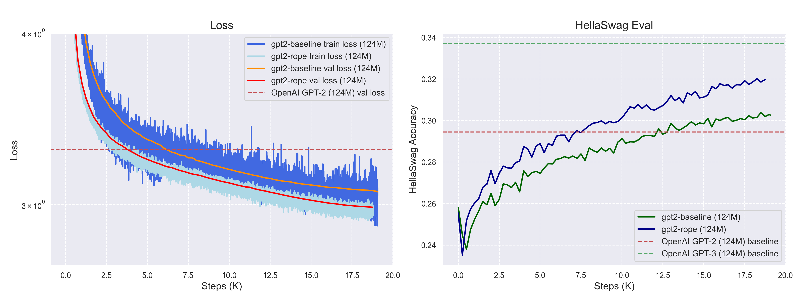
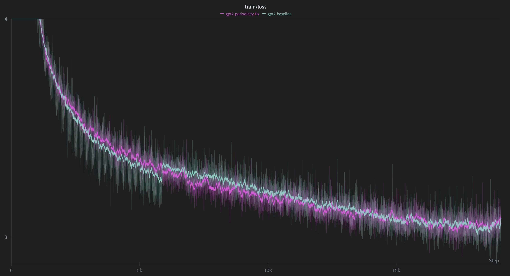
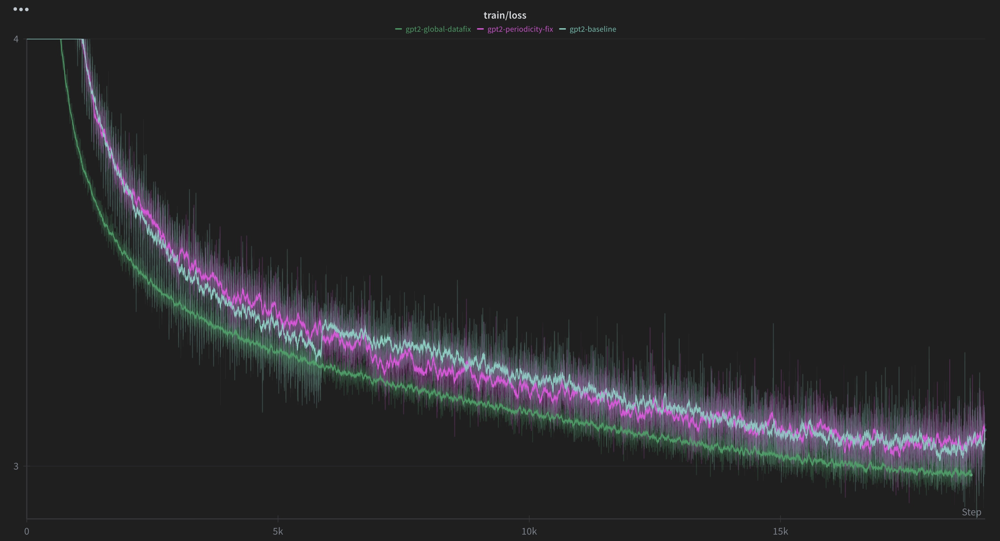

# GPT-2 Implementation from Scratch and More...

This folder contains my implementation of GPT-2 (124M) from scratch, following Andrej Karpathy's ["Let's reproduce GPT-2"](https://www.youtube.com/watch?v=l8pRSuU81PU&t=1388s) video tutorial. Like in the video, I first achieved a baseline that surpasses the original GPT-2 (124M) performance. Building on this, I then tried a few different data and architecture optimizations to push the validation loss and HellaSwag accuracy even further.



The plot above compares the baseline implementation (which already surpassed the original GPT-2 performance) with my **best-performing experiment, `gpt2-rope`**. It incorporates multiple improvements including RoPE, global data shuffling, and an optimized learning rate schedule. This configuration pushed `validation loss` to **2.987** and `HellaSwag accuracy` to **0.320**.

## Experiments

| Experiment | Min Validation Loss | Max HellaSwag Acc | Description |
|------------|---------------------|-------------------|-------------|
| gpt2-baseline | 3.065753 | 0.303724 | Original GPT-2 architecture |
| gpt2-periodicity-fix | 3.063873 | 0.305517 | Fixed data loading periodicity |
| gpt2-lr-inc | 3.021046 | 0.315475 | Increased learning rate by 3x and reduced warmup steps |
| gpt2-global-datafix | 3.004503 | 0.316869 | Used global shuffling with better indexing |
| gpt2-rope | **2.987392** | **0.320155** | Replaced learned embeddings with RoPE |
| gpt2-swiglu<sup>*</sup>  | 3.031061 | 0.317467 | Replaced FFN with SwiGLU-FFN activation |

- You can view detailed training metrics and curves on W&B: [link](https://wandb.ai/garg-aayush/pre-training/)
- You can also find the data and checkpoints here:
  - Dataset (training and validation): [Google Drive](https://drive.google.com/drive/folders/1FGHKpY0_jJmSR_j7ki4oyoxK-fJgldgG?usp=sharing)
  - Best checkpoints for each experiment: [Google Drive](https://drive.google.com/drive/folders/1S9mFDMG3ZPjA-JGdx_814T_NCVSjUJO-?usp=sharing)
- All experiments were trained on ~10B tokens for **1 epoch** on the [FineWeb-Edu](https://huggingface.co/datasets/HuggingFaceFW/fineweb-edu) dataset
- Training was performed on 4× H100 80GB SXM GPUs on [RunPod](https://runpod.io/)
- <sup>*</sup> `gpt2-swiglu` was stopped early at ~15K steps to save compute costs


### Experiments Details

#### 1. `gpt2-baseline`: Baseline implementation
**Commit**: `301fb8c`

- I started with a faithful reproduction of the GPT-2 (124M) architecture, implementing the original paper's design choices: GELU activation, learned positional embeddings, and pre-norm transformer blocks as per Andrej's video.
- The baseline achieved a validation loss of 3.066, slightly better than OpenAI's reported performance.


#### 2. `gpt2-periodicity-fix`: Soft periodicity fix for data loading
**Commit**: `6061123`
- As discussed in the video, the periodicity and sudden spikes in the loss curve were due to a data ordering issue.
<p align="center">

</p>

- To address this, I implemented a soft periodicity fix for data loading that:
    - Randomly shuffles the order of documents within each shard on every epoch
    - Randomly shuffles the order of shards
- You can find the implementation in the notebook [dataloader_periodicity_fix.ipynb](play-nbs/dataloader_periodicity_fix.ipynb).
- This reduced the periodicity issue; however, the loss curve still exhibits some wiggles.


#### 3. `gpt2-lr-inc`: Learning rate optimization
**Commit**: `f1d6c78`

- Following insights from the video, I experimented with more aggressive learning rates.
    - Increased max learning rate by 3× and decreased warmup to ~285 steps
- This led to a significant improvement, with validation loss dropping to 3.021 and HellaSwag accuracy rising to 0.3154.


#### 4. `gpt2-global-datafix`: Global data shuffling
**Commit**: `c952c26`

- The earlier periodicity fix was local to each shard. To achieve true global randomness across the entire 10B-token dataset, I implemented a global indexing system that maps virtual indices to `(shard, position)` tuples.
  - Each batch now samples from random positions across all shards
  - This maintains efficient sequential reading within shards while achieving global randomness
- You can see the implementation in the notebook [dataloader_global_shuffle.ipynb](play-nbs/dataloader_global_shuffle.ipynb).
- This further improved validation loss to 3.005 and produced a much smoother loss curve (far less wiggly and jumpy).
<p align="center">

</p>

> Note, there is some issue with the global shuffling as the training abruptly stops at around 18.25K steps just before the completion. I need to investigate this further in future.

#### 5. `gpt2-rope`: Rotary positional embeddings
**Commit**: `2e339d1`

- This was the first architectural change I made. I replaced learned positional embeddings with RoPE, which significantly improved performance.
- Please see the implementation in [rope.ipynb](play-nbs/rope.ipynb) and notes in [RoPE.md](notes/RoPE.md).
- For this experiment, the validation loss dropped to 2.987 and HellaSwag accuracy increased to 0.320.

#### 6. `gpt2-swiglu`: SwiGLU activation
**Commit**: `b3dd4d8`

- Following trends in modern LLMs (LLaMA, PaLM), I experimented with replacing the standard FFN with SwiGLU-FFN.
- Please see the implementation in [`swiglu.ipynb`](play-nbs/swiglu.ipynb).
- This did not meet my expectations. The loss curve did not show faster convergence, so I stopped training early at ~15K steps to save compute.
- I think at the 124M-parameter scale, SwiGLU is unable to provide a meaningful boost to the performance.


## Running the training

- Make sure you have:
    - PyTorch 2.8+ with CUDA support
    - A [Weights & Biases](https://wandb.ai) account for logging (free tier works fine)
- Install the required dependencies:
    ```bash
    pip install -r requirements.txt
    ```
- Also, either download the training and validation dataset from [Google Drive](https://drive.google.com/drive/folders/1FGHKpY0_jJmSR_j7ki4oyoxK-fJgldgG?usp=sharing) or prepare it using [fineweb-modal.py](fineweb-modal.py).

- Before running, you'll need to adjust a few parameters in `train_gpt2.py`:
    ```python
    wandb_project = "pre-training"     # your W&B project name
    wandb_run_name = "gpt2-run"   # name for this specific run
    data_root = "/workspace/shards"    # path to your prepared dataset shards
    ckpt_dir = "/workspace/ckpt"       # where to save checkpoints
    
    # You might need to adjust some training parameters to match available GPU memory.
    batch_size = 524288    # 2^19, ~0.5M tokens, matching GPT-3 124M model
    B = 64                 # batch size
    T = 1024                # sequence length
    ```
- Running the script:
    ```bash
    # single GPU training
    python train_gpt2.py

    # multi-GPU training (4 GPUs)
    torchrun --nproc_per_node=4 train_gpt2.py

    # If you encounter NCCL errors (common on consumer GPUs)
    NCCL_P2P_DISABLE=1 torchrun --nproc_per_node=4 train_gpt2.py

    # On 4xH100 SXM GPUs, 1 epoch training completes in <2 hrs.
    ```
- You can also check the commits listed above to run training for each experiment.
    


## Repository structure

```
gpt-2/
├── model.py                    # Core GPT-2 model implementation with improvements
├── train_gpt2.py               # Training script with DDP support
├── hellaswag.py                # HellaSwag evaluation implementation (taken from Andrej's repo)
├── fineweb-modal.py            # Dataset preprocessing using Modal
├── requirements.txt            # Project dependencies
│
├── notes/
│   ├── lecture_notes.md        # Detailed notes from Karpathy's video
│   └── RoPE.md                 # Rotary Positional Embeddings explanation
│
├── play-nbs/                   # Experimental notebooks
│   ├── dataloader_periodicity_fix.ipynb
│   ├── dataloader_global_shuffle.ipynb  
│   ├── rope.ipynb
│   └── swiglu.ipynb
│
├── make-plots.ipynb            # Notebook for generating comparison plots
├── load-hf-gpt2.ipynb          # Load and test Hugging Face GPT-2 model
│
├── data/                       # Training data
│   └── input.txt               # Tiny Shakespeare for debugging
│
├── images/                     # Supporting images for notes and README
│
└── log/                        # Training logs
```


## To do

- [ ] Fix the global shuffling bug
- [ ] Add checkpoint resuming logic
- [ ] Run the best configuration for multiple epochs and T=2048 (GPT-3 settings)
- [ ] Add inference script for text generation
- [ ] MFUs are low; try to improve them


## Updates

### Sep 24th, 2025
- Completed the first version of the GPT-2 implementation from scratch along with the comparison plots.
