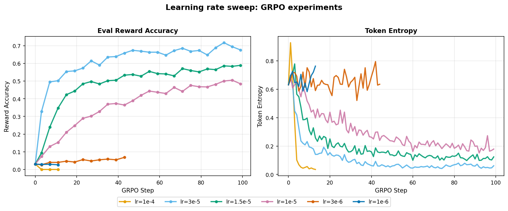
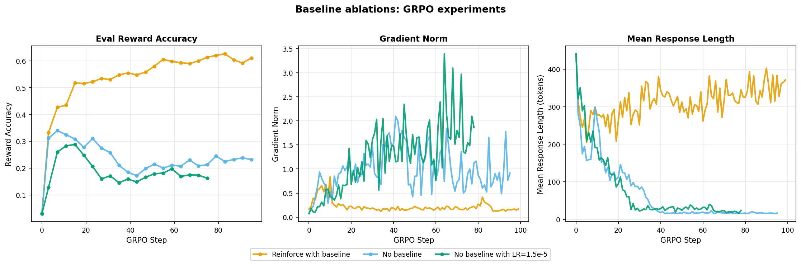
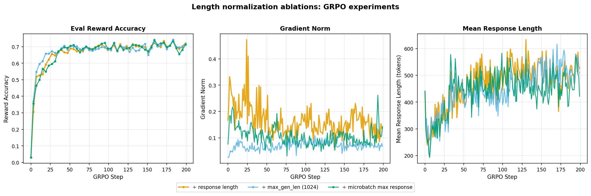
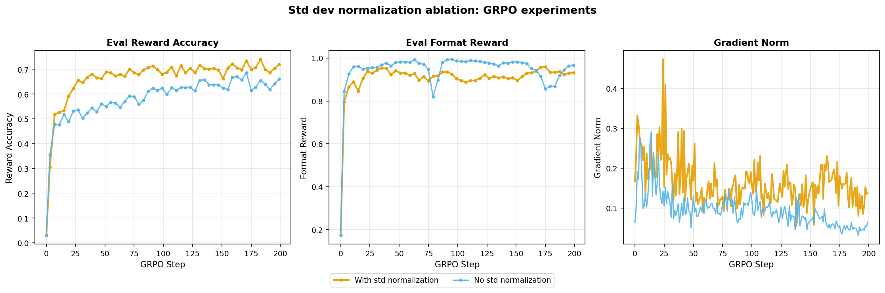
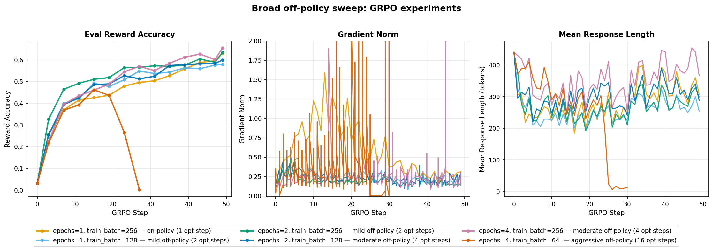
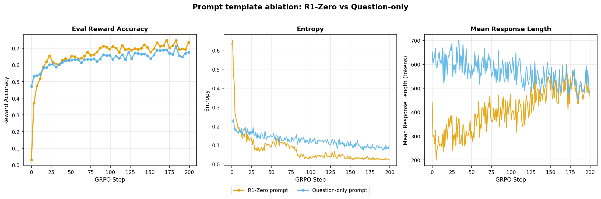
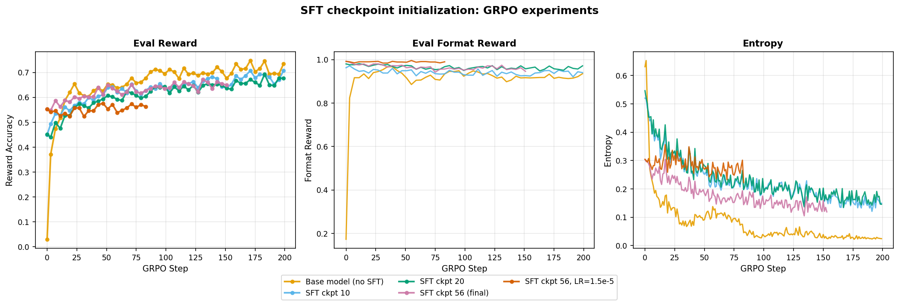

# GRPO from Scratch

This folder contains my **from-scratch implementation** of Group Relative Policy Optimization (GRPO), loosely following Stanford's [CS336 Assignment 5](https://github.com/stanford-cs336/assignment5-alignment/blob/main/cs336_spring2025_assignment5_alignment.pdf). I trained [Qwen2.5-Math-1.5B](https://huggingface.co/Qwen/Qwen2.5-Math-1.5B) with verifiable math rewards and ran a series of ablation studies to build intuition on what actually matters in GRPO training.

> Best: **~75% reward accuracy** on MATH validation (up from ~3% base model accuracy)


There were 3 motivations for this project:

1. Write the GRPO training loop from scratch for the sake of understanding.
2. Train with pure RL (no SFT) and see how high reward accuracy we can push.
3. **Most importantly**, run ablation studies to understand and build intuition on what matters in GRPO training—the different design choices we can make and how to interpret the different metrics.

You can find the blog post for this project here: https://aayushgarg.dev/posts/2026-02-26-grpo-from-scratch

## Table of Contents
- [Training Loop](#training-loop)
- [GPU Memory Optimization (Fitting on 24 GB)](#gpu-memory-optimization-fitting-on-24-gb)
- [Scaling to Modal (H100)](#scaling-to-modal-h100)
- [Ablation Studies](#ablation-studies)
  - [Learning Rate Sweep](#learning-rate-sweep)
  - [Baseline Ablation](#baseline-ablation)
  - [Length Normalization](#length-normalization)
  - [Standard Deviation Normalization](#standard-deviation-normalization)
  - [Off-Policy Sweep](#off-policy-sweep)
  - [Prompt Template Ablation](#prompt-template-ablation)
  - [SFT Checkpoint Initialization](#sft-checkpoint-initialization)
- [Key Takeaways](#key-takeaways)
- [Datasets and Checkpoints](#datasets-and-checkpoints)
- [Folder Structure](#folder-structure)
- [Commit History](#commit-history)


## Training Loop

GRPO is a RL algorithm that eliminates the need for a separate critic/value model by using group-relative advantages for each prompt. It generates multiple candidate outputs, scores them, and normalizes rewards within the group to get advantages. Instead of imitating expert reasoning traces (SFT), it lets the model discover its own strategies.

The algorithm has two nested loops:

- **Outer loop**: sample a batch of prompts -> generate G rollouts per prompt via vLLM -> compute rewards -> normalize advantages within each group
- **Inner loop**: policy gradient updates over the rollout batch with gradient accumulation

For the training data, I used the MATH dataset (problems only, no reasoning traces) from the [CS336 MATH dataset](https://github.com/kkaitlyn111/cs336-a5-RL/tree/main/MATH) repo.

### Key files and points

- Key files:
  - [`train_grpo.py`](train_grpo.py) — main training script (outer + inner loops wired together)
  - [`utils/grpo.py`](utils/grpo.py) — `compute_group_normalized_rewards()`, loss functions, `grpo_microbatch_train_step()`
  - [`utils/dataset.py`](utils/dataset.py) — data loading and `tokenize_prompt_and_output()`
  - [`utils/vllm.py`](utils/vllm.py) — vLLM engine init and rollout generation
  - [`utils/evaluate.py`](utils/evaluate.py) — intermediate validation evaluation
  - [`utils/drgrpo_grader.py`](utils/drgrpo_grader.py) — math answer grading for reward computation
  - [`configs/defaults.py`](configs/defaults.py) — OmegaConf structured config dataclasses

- Key points:
  - For the full list of loss types and config parameters, see the [Default configuration](Notes.md#default-configuration) section in Notes.md.
  - All configs use OmegaConf structured dataclasses in `configs/defaults.py`. YAML files (e.g. `configs/test.yaml`) only need to specify overrides.
  - All training runs are logged to W&B: [wandb.ai/garg-aayush/grpo](https://wandb.ai/garg-aayush/grpo).


## GPU Memory Optimization (Fitting on 24 GB)

I developed and tested on an RTX 4090 (24 GB VRAM), which required a few memory optimizations to avoid OOM errors with the default parameters:

- **Peak memory tracking** (`f878a77`): Log peak memory at important junctures in the training loop.
- **Gradient checkpointing** (`c2bce8d`): Recomputes activations during backward pass instead of storing them. ~30% memory savings at the cost of some speed.
- **vLLM sleep mode** (`4ddca51`): Offloads vLLM KV cache and weights to CPU during training. Frees GPU memory for the backward pass and prevents the vLLM cache from competing with training activations.
- **8-bit AdamW** (`eb52b83`): Uses bitsandbytes `AdamW8bit` instead of `AdamW`. Reduces optimizer state memory by ~half.

With all optimizations, training runs successfully with `rollout_batch_size=256`, `group_size=8`, `gradient_accumulation_steps=256` (microbatch=1) on 24 GB. See [`configs/test.yaml`](configs/test.yaml) for the reference config.


## Scaling to Modal (H100)

Local training on the 4090 works but is slow (~28 min / 20 GRPO steps) and only runs one experiment at a time. I scaled to [Modal](https://modal.com/) to run faster experiments in parallel on H100s.

> For setup and launch commands, see the [Scaling to Modal](Notes.md#scaling-to-modal-h100) section in Notes.md.

### H100 config optimization

On the H100, I disabled the memory tricks that exist only to fit on 24 GB and used larger microbatches:

| Flag | RTX 4090 | H100 | Why |
|------|----------|------|-----|
| `use_gradient_checkpointing` | `true` | `false` | No need to recompute activations -> faster backward |
| `use_bnb_adamw8bit` | `true` | `false` | Fused float32 AdamW is faster on H100 |
| `gradient_accumulation_steps` | `256` (microbatch=1) | `64` (microbatch=4) | Better tensor core utilization |
| `old_log_probs_train_size` | `2` | `4` | Fewer, larger passes for old log probs |

**Timing comparison (20 GRPO steps):**

| Hardware | Config | Time |
|----------|--------|------|
| RTX 4090 (24 GB) | RTX 4090 defaults | ~28 min |
| H100 (80 GB) | RTX 4090 defaults (unchanged) | ~18 min |
| H100 (80 GB) | H100-optimized | ~10 min |

> **Cost note:** All ablation studies combined (including early-terminated runs) cost approximately **$140** on Modal.


## Ablation Studies

I ran a series of ablation studies to understand what matters in GRPO training. Each ablation isolates one design choice while keeping everything else fixed.

Experiment lengths vary intentionally from 50 steps for broad sweeps to identify promising configs, to 100-200 steps for the final comparisons. This is done to keep the total cost manageable while still getting the information I needed.

> For detailed analysis and observations for each ablation, see the [Ablation Studies](Notes.md#ablation-studies) section in Notes.md.

### Learning Rate Sweep

The learning rate is the most critical hyperparameter. A high `lr` in GRPO doesn't just cause loss divergence—it can collapse the policy onto degenerate outputs before learning anything useful.

I ran a log-spaced search from `1e-6` to `1e-4` for 100 steps each. Configs: [`configs/lr_sweep/`](configs/lr_sweep/).



- `1e-6` and `3e-6`: gradient signal too weak, eval reward barely moves.
- `1e-4`: policy collapse—response length spikes, token entropy drops to near zero.
- `1e-5` to `3e-5`: reward rises steadily, response length stabilizes, entropy decreases smoothly.

**Winner: `lr=3e-5`** is the most stable training and highest reward accuracy.


### Baseline Ablation

Vanilla REINFORCE has notoriously high variance. Subtracting the group mean reward (a zero-bias baseline) should reduce variance. 

I ran three runs: `no_baseline`, `no_baseline` at lower `lr`, and `reinforce_with_baseline`. Configs: [`configs/baselines/`](configs/baselines/).



- `reinforce_with_baseline`: eval reward climbs steadily to ~0.61, gradient norm stays stable, response length stays 300–350 tokens.
- Both `no_baseline` runs: peak early then decline. Gradient norm keeps increasing, and both suffer rapid response length collapse.

**Winner: `reinforce_with_baseline`**, subtracting the group mean is essential for stable training.


### Length Normalization

When aggregating per-token losses, normalization mode affects how much gradient signal each token receives:

- `mean`: divide by number of response tokens; short correct answers get disproportionately large per-token gradients.
- `constant`: divide by `max_gen_len=1024` (DeepSeek's approach); same gradient magnitude regardless of length.
- `microbatch`: normalize by the longest response in the current microbatch; a middle ground.

Configs: [`configs/length_normalization/`](configs/length_normalization/).



All three modes converge to similar final reward accuracy. The only observable difference is gradient scale—`constant` produces lower norms since it divides by 1024, which is 2–2.5× larger than typical response length.

**Winner: `mean` (kept as default)**, length normalization mode has minimal impact on final reward for math reasoning with binary reward.

### Standard Deviation Normalization

Standard GRPO divides advantages by the group std: `(reward - mean) / (std + eps)`. [Dr. GRPO](https://arxiv.org/abs/2503.20783) argued this can inflate advantages for low-variance groups (easy or hard problems where all rollouts get the same reward). This ablation tests whether removing the division helps.

Configs: [`configs/std_dev/`](configs/std_dev/).



- **With std normalization**: reaches higher final reward accuracy (~0.72).
- **Without**: plateaus at ~0.65, but gradient norms are lower and more stable.

Removing std normalization does improve gradient stability (confirming that dividing by group std amplifies gradients for low-variance groups) but it doesn't translate to better performance here—the ~0.07 reward gap is too large to ignore.

**Winner: keep std normalization** — the reward benefit outweighs the noisier gradients.


### Off-Policy Sweep

On-policy training is clean but expensive: lots of inference to generate rollouts for just a single gradient step. Can we take multiple gradient steps per rollout batch without destabilizing training?

#### Broad sweep (50 steps)

6 configs varying `epochs_per_rollout_batch` from 1 (on-policy) to 4 (16 optimizer steps per GRPO step). Configs: [`configs/off_policy_sweep/`](configs/off_policy_sweep/).



- Most configs converge to ~0.55–0.65 eval reward.
- `e4_tb64_ga16` (16 opt steps/GRPO) collapses midway—gradient norm spikes and response length drops to ~100 tokens. Classic policy drift failure mode.

#### Full sweep (200 steps)

Selected the three most promising configs for 200-step training.


- On-policy (`e1_tb256_ga64`) is consistently best, converging fastest to ~0.65–0.75.
- Mild off-policy (2 epochs) tracks slightly behind and converges to ~0.65–0.70.
- Side note: on-policy `grpo_clip` is numerically equivalent to `grpo_no_clip` with 1 opt step—the ratio is ~1.0 so clipping never fires.

**Winner: on-policy (`epochs_per_rollout_batch=1`)**, reusing rollouts does not help enough to justify the extra compute.


### Prompt Template Ablation

Compared the `r1_zero` structured prompt (with `<think>...</think>` and `<answer>...</answer>` blocks) against question-only (just `{question}`), each paired with its matching reward function.

Configs: [`configs/question_only/`](configs/question_only/).



- Question-only starts much higher because Qwen2.5-Math-1.5B is pre-trained on math with `\boxed{}` formatting—it already solves ~50% out of the box. R1-zero starts near zero (unfamiliar format) but catches up quickly and finishes ahead.
- Token entropy is the most revealing metric here: R1-zero settles at much lower entropy, indicating a sharper, more constrained policy.

**Winner: R1-zero structured prompt**, the dedicated reasoning scratchpad provides a consistent accuracy advantage by constraining the output space.

### SFT Checkpoint Initialization

Not in the original assignment but a natural question: we already have an SFT model at ~53% accuracy. Can GRPO push it higher? Or does starting from a pre-narrowed distribution hurt exploration?

I ran five runs: base model, three SFT checkpoints (early/mid/final), and final checkpoint at lower `lr`. Configs: [`configs/sft_grpo/`](configs/sft_grpo/).



- The base model outperforms all SFT-initialized runs. More SFT training -> lower GRPO ceiling.
- SFT checkpoints show higher entropy throughout, meaning the pre-narrowed distribution actually makes it harder for GRPO to explore and find better strategies.
- Lowering `lr` on the final SFT checkpoint helps only marginally—the bottleneck is distribution narrowing, not gradient step size.

**Winner: base model**, SFT initialization in this casehurts GRPO by narrowing the exploration space before RL even starts.


## Key Takeaways

**Best configuration:**
- on-policy (`epochs_per_rollout_batch=1`)
- `lr=3e-5`
- `loss_type=grpo_clip`
- `use_std_normalization=True`
- R1-zero structured prompt
- base model (no SFT initialization)

**Key lessons:**
- **`eval/reward` is the north star metric**—it directly measures what we care about.
- **`grad_norm` and `mean_response_length` are the early warning signals**—spikes in grad norm and collapse in response length predict reward collapse well in advance.
- **Binary math reward is robust to some design choices** (length normalization mode) **but sensitive to others** (baseline subtraction, learning rate).
- **On-policy training wins**—reusing rollouts introduces policy drift that isn't worth the compute savings.
- **The R1-zero structured prompt matters**—a dedicated reasoning scratchpad produces sharper final policies and higher accuracy.
- **SFT initialization hurts**—when the SFT data is not distilled from a larger teacher model, starting from base is better.


## Datasets and Checkpoints

All training checkpoints are uploaded to Hugging Face: [garg-aayush/cs336-grpo-exps](https://huggingface.co/garg-aayush/cs336-grpo-exps).

Each run directory contains:
- `checkpoint_last/` — model weights at the final step
- `checkpoint_best/` — model weights at peak `eval/reward` (for completed runs)
- `metadata.json` — run summary with last/best steps and available checkpoints
- Rollout JSONL files at key steps for inspection

**Datasets:**
The training and validation data (MATH problems, no reasoning traces) follows the CS336 MATH dataset format. I sourced it from the [CS336 MATH dataset](https://github.com/kkaitlyn111/cs336-a5-RL/tree/main/MATH) repo. The R1-zero prompt template is in [`data/r1_zero.prompt`](data/r1_zero.prompt).

**Training logs:** [wandb.ai/garg-aayush/grpo](https://wandb.ai/garg-aayush/grpo)


## Folder Structure

```
grpo/
├── train_grpo.py               # Main GRPO training script
├── train_on_modal.py           # Modal wrapper: merges config + submits to H100
├── run_jobs.sh                 # Helper script for launching multiple runs
│
├── utils/
│   ├── grpo.py                 # Core GRPO functions: rewards, losses, microbatch step
│   ├── dataset.py              # Data loading and tokenization
│   ├── vllm.py                 # vLLM engine init and rollout generation
│   ├── evaluate.py             # Intermediate validation evaluation
│   ├── drgrpo_grader.py        # Math answer grading for reward computation
│   ├── helper.py               # Misc helper functions
│   ├── constants.py            # Shared constants
│   ├── setup_modal.py          # Modal: download model weights + upload data
│   └── upload_to_hf.py         # Modal: upload checkpoints to HuggingFace Hub
│
├── configs/
│   ├── defaults.py             # OmegaConf structured config dataclasses
│   ├── test.yaml               # Local RTX 4090 test config
│   ├── test_modal.yaml         # Modal (H100) test config
│   ├── test_h100_modal.yaml    # H100-optimized config
│   ├── baselines/              # Baseline ablation configs
│   ├── lr_sweep/               # Learning rate sweep configs
│   ├── length_normalization/   # Length normalization configs
│   ├── std_dev/                # Std dev normalization configs
│   ├── off_policy_sweep/       # Off-policy sweep configs
│   ├── question_only/          # Question-only prompt configs
│   └── sft_grpo/               # SFT checkpoint initialization configs
│
├── data/
│   └── r1_zero.prompt          # R1-Zero structured prompt template
│
├── play-scripts/
│   ├── summarize_runs.py       # Fetch W&B runs -> grpo_run_summary.csv
│   ├── grpo_run_summary.csv    # Cached W&B run summary
│   └── plot-scripts/           # Ablation plotting scripts (one per ablation)
│
├── results/                    # Ablation plots and CSVs
│   ├── best_run/
│   ├── baselines/
│   ├── lr_sweep/
│   ├── length_normalization/
│   ├── std_dev/
│   ├── off_policy_sweep/
│   ├── off_policy_full_sweep/
│   ├── prompt_ablation/
│   └── sft_grpo/
│
├── Notes.md                    # Detailed development notes
└── Readme.md                   # This file
```


## Commit History

If you want to understand how I approached the implementation, I recommend exploring the commit history. Each commit represents an incremental step—setting up helper functions, building the training loop, adding memory optimizations, running ablation experiments, and analyzing results.

**Phase 1: Core Implementation**

| Commits | Task | Description |
|---------|------|-------------|
| `58ecd8c` | Setup | Initialize grpo folder |
| `877ea05` -> `da8b36e` | Loss functions | `compute_group_normalized_rewards`, `no_baseline`, `reinforce_with_baseline`, `grpo_clip`, `grpo_no_clip` |
| `9f76d6b` -> `d0d6e00` | Helpers | `masked_mean`, `masked_normalize`, `grpo_microbatch_train_step` |
| `34e2d28` -> `c96b970` | Training loop | OmegaConf config, data loading, vLLM init, full GRPO outer+inner loop |
| `f878a77` -> `eb52b83` | Memory optimizations | Peak memory tracking, gradient checkpointing, vLLM sleep mode, 8-bit AdamW |
| `e1dcc23` -> `00db81c` | Observability | Response length metric, intermediate evaluations, checkpointing, rollout logging, W&B, timing metrics |

**Phase 2: Modal Setup**

| Commits | Task | Description |
|---------|------|-------------|
| `28390e3` -> `026f4cc` | Modal | Training scripts, H100-optimized config, bug fixes |

**Phase 3: Ablation Experiments**

| Commits | Task | Description |
|---------|------|-------------|
| `c179dbe` | `lr` sweep | Log-spaced search from `1e-6` to `1e-4` |
| `33485b5` | Baselines | `no_baseline` vs `reinforce_with_baseline` vs `grpo_clip` |
| `a2cb59a` | Length normalization | `mean` vs `constant` vs `microbatch` |
| `db6b623` | Std dev normalization | With vs without group std division |
| `08e1091` | Off-policy sweep | 1 to 16 optimizer steps per rollout batch |
| `5c072b7` | Prompt template | R1-Zero structured prompt vs question-only |
| `21a962b` | SFT initialization | Base model vs SFT checkpoints as GRPO starting point |

**Phase 4: Plotting and Uploading**

| Commits | Task | Description |
|---------|------|-------------|
| `3330d85` -> `717434d` | Plots | Plot scripts + figures for all ablations, best run, `summarize_runs.py` |
| `a84bc5a` | Reorganization | Moved `setup_modal.py` and `upload_to_hf.py` into `utils/` |

> For a detailed per-commit description, see [Notes.md](Notes.md#commit-history).


## A Note on AI Assistance

Different parts of this project were written in different ways. Below is an honest breakdown:

- **Training and GRPO implementation** (`train_grpo.py`, `utils/grpo.py`, and related logic): written the old-fashioned way, line by line. The whole point of this project was to understand GRPO deeply, so no shortcuts here.
- **Plot scripts and Modal infrastructure** (`play-scripts/`, `utils/setup_modal.py`, `utils/upload_to_hf.py`): written with the help of [Claude Code](https://claude.ai/code) and [Context7](https://context7.com/). These are mostly boilerplate and plumbing. Accelerating them with AI tools was a reasonable trade-off.
- **Notes.md**: written manually and then reviewed and corrected with AI assistance.
- **This README**: mostly AI-generated using Claude Code and then reviewed and edited.
