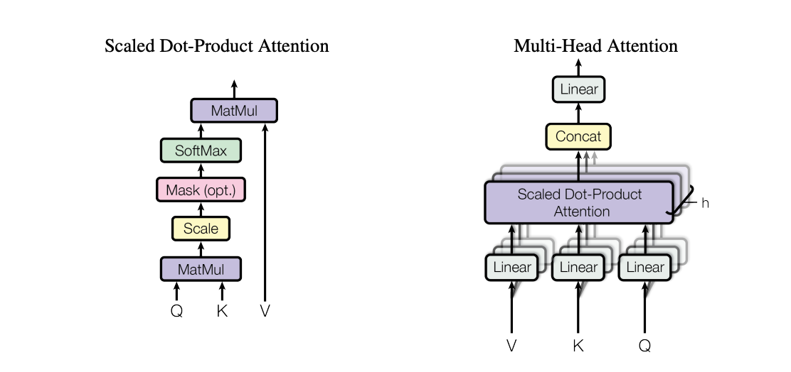
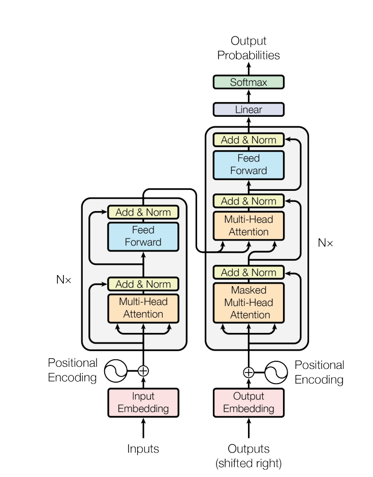
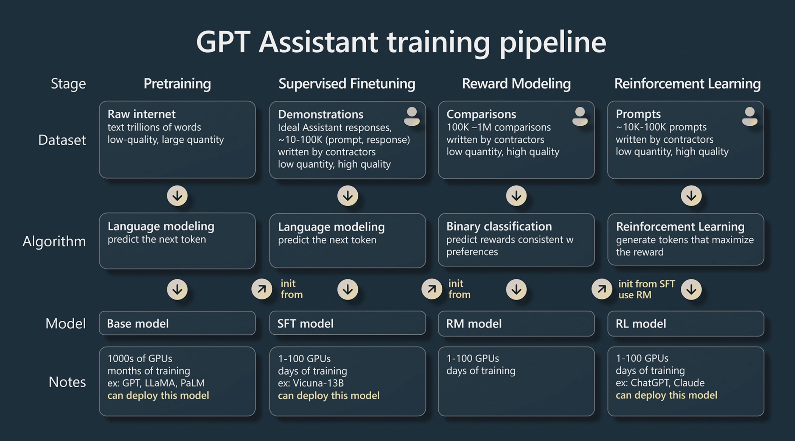

# Notes

## Multi-Head Attention


- It's the process of applying multiple attention mechanisms in parallel and concatenating their results.

- It's fairly straightforward to implement. If we want multi-head attention, we need multiple heads of self-attention running in parallel. In PyTorch, we can do this by creating as many heads as we want and determining the head size for each. We then run all of them in parallel, collect the outputs in a list, and concatenate them over the channel dimension.

- Currently, we don't have just a single attention head with a size of 32 (since `n_embed` is 32). Instead of having one communication channel, we now have four communication channels in parallel. Each of these channels will be correspondingly smaller (e.g., `n_embed // 4`, resulting in 8-dimensional vectors).

- This is similar to grouped convolutions, where instead of one large convolution, the operation is performed in groups. That's the essence of multi-headed self-attention.

- It's helpful to have multiple communication channels because tokens have a lot of information to exchange. They might need to identify consonants, vowels, or patterns at different positions. Multiple independent channels of communication allow the model to gather diverse types of data, which aids in decoding the output.



## Feed-Forward Networks

- Notice that there's a feed-forward component here, which is grouped into a block that gets repeated. This "position-wise feed-forward network" is just a simple multi-layer perceptron (MLP).

- I want to add computation into the network, and this computation should be on a per-node level.

- Previously, we had multi-headed self-attention for communication, but we moved too quickly to calculating the logits. The tokens looked at each other but didn't have enough time to "think" about what they found. To address this, I've implemented a simple feed-forward layer. This layer is just a linear layer followed by a ReLU non-linearity, which I call `feed_forward` with `n_embed` dimensions.

- This feed-forward layer is called sequentially right after the self-attention. So, the sequence is self-attention, then feed-forward. You'll notice that the feed-forward layer's linear transformation operates on a per-token level; all the tokens do this independently.

- So, self-attention is the communication phase. Once the tokens have gathered data, they need to process that data individually. That's what the feed-forward network does.

## Residual Connections

- This is one of two optimizations that dramatically help with the depth of these networks and ensure they remain optimizable.

- Skip connections, sometimes called residual connections, come from the "Deep Residual Learning for Image Recognition" paper (c. 2015).

- This is what it means: you transform data but then add a skip connection from the previous features. I like to visualize it as a residual pathway where computation happens from top to bottom. You can "fork off" from this pathway, perform some computation, and then project back to the pathway via addition. The path from inputs to targets is composed of a series of additions.

- This is useful because, during backpropagation (as seen in the micrograd video), addition distributes gradients equally to both of its input branches. The gradients from the loss "hop" through every addition node all the way back to the input and also fork off into the residual blocks. This creates a "gradient superhighway" that goes directly from the supervision to the input, unimpeded. The residual blocks are usually initialized to contribute very little to the residual pathway at the start.

- They are initialized this way so that, in the beginning, they are almost non-existent. During optimization, they come "online" over time and start to contribute. This means that at initialization, the gradient can flow unimpeded from the supervision to the input, and then the blocks kick in over time. This dramatically helps with optimization.

## Layer Normalization

- Layer normalization is the second crucial optimization and a key component of the Transformer architecture.

- In batch normalization, we normalize across the batch dimension. For any individual neuron, we ensure it has zero mean and unit standard deviation across all examples in the batch. This means we're normalizing columns; each feature dimension is normalized independently across all samples.

- However, layer normalization works differently. Instead of normalizing across the batch dimension, we normalize across the feature dimension for each individual example. This means we're normalizing rows; each sample's features are normalized independently.

- The implementation is surprisingly simple. If we had batch normalization code that normalizes across dimension 0 (the batch dimension), we would just change it to normalize across dimension 1 (the feature dimension) to get layer normalization.

- Layer normalization has several advantages over batch normalization in the context of Transformers:
    - **No dependency on batch size**: Layer norm works the same regardless of batch size, even with a batch size of 1.
    - **Simpler implementation and tracking**: We don't need to maintain running mean and variance buffers. There's no distinction between training and test time.
    - **Better for sequence models**: Each token's features are normalized independently, which is more appropriate for language modeling.

## Post vs Pre-Layer Normalization

- The original Transformer paper used **post-layer normalization**, where layer norm is applied *after* the multi-head attention and feed-forward operations.
- However, modern implementations have largely switched to **pre-layer normalization**, where layer norm is applied *before* the operations.
- The switch to pre-layer normalization likely happened for a few reasons:
    - **Better gradient flow**: Pre-layer norm creates a cleaner residual pathway, allowing gradients to flow more directly through the network.
    - **More stable training**: Normalization happens before potentially destabilizing operations (attention and feed-forward), leading to more stable gradients.

## Scaling and Pushing the Performance

One key addition is **Dropout**. Dropout is a regularization technique that can be added right before the residual connections back into the residual pathway. We can apply dropout:
- At the end of multi-headed attention.
- When calculating the attention affinities after the softmax.
- At various other points to randomly prevent some nodes from communicating.

Dropout, from a 2014 paper, works by randomly shutting off a subset of neurons during each forward/backward pass. The mask of what's being dropped out changes every iteration, effectively training an ensemble of sub-networks. At test time, all neurons are enabled, and those sub-networks merge into a single ensemble. This is a regularization technique I added because I was about to scale up the model significantly and was concerned about overfitting.

### Updated Hyperparameters

- **Batch size**: Increased to 64 (from a much smaller value).
- **Block size**: Increased to 256 characters of context (previously just 8 characters).
- **Learning rate**: Reduced slightly because the neural net is now much larger.
- **Embedding dimension**: 384.
- **Number of heads**: 6 (384 / 6 = 64 dimensions per head, which is standard).
- **Number of layers**: 6 (Transformer Blocks).
- **Dropout**: 0.2 (20% of intermediate calculations are disabled each pass).

- After training this scaled-up model, the results were impressive. The validation loss improved to **1.48**—a significant improvement from just scaling up the neural network with our existing code.
- The generated text is much more recognizable as Shakespeare-like output. While still nonsensical upon close reading, it maintains the characteristic structure and style of the input text: someone speaking in a Shakespearean manner with proper formatting and dialogue structure.
- This is just a character-level Transformer trained on 1 million characters from Shakespeare, but it's a good demonstration of what's possible at this scale.

## Original Encoder-Decoder Design

```
# French to English translation example:

# <--------- ENCODE ------------------><--------------- DECODE ----------------->
# les réseaux de neurones sont géniaux! <START> neural networks are awesome!<END>
```

The original Transformer paper used an encoder-decoder architecture because it was designed for **machine translation**. Here's how it works:
- **Encoder**: Processes the input language (e.g., a French sentence).
  - Uses self-attention to understand relationships within the input.
  - No masking is needed since all input tokens are available.
  - Creates rich representations of the source sentence.

- **Decoder**: Generates the output language (e.g., an English translation).
  - Uses masked self-attention (like our implementation) for auto-regressive generation.
  - **Cross-attention**: This is the key piece missing from our implementation.
    - It allows the decoder to "look at" and condition on the encoded input.
    - The decoder can attend to any part of the source sentence while generating each target word.
    - This is how the model learns to translate—it knows what it's translating from.

- **Cross-attention mechanism**:
  - **Queries (Q)**: Come from the decoder (the part generating the target language).
  - **Keys (K) and Values (V)**: Come from the encoder (the processed source language).
  - This allows each position in the target sequence to attend to all positions in the source sequence.
  - This is unlike self-attention, where Q, K, and V all come from the same sequence.

## State of GPT (GPT-3)


To train a model like ChatGPT, there are roughly two main stages: **pre-training** and **fine-tuning**.

### Stage 1: Pre-training

In the pre-training stage, we train a decoder-only Transformer on a large chunk of the internet to generate coherent text. This is very similar to what we've done, except our pre-training step was on a much smaller scale.

#### Scale Comparison
Let me put this in perspective with some numbers:

**Our Shakespeare Model:**
- **Parameters**: ~10 million.
- **Dataset**: ~1 million characters (roughly 300,000 tokens in OpenAI's vocabulary).
- **Training**: Character-level tokenization.

**GPT-3:**
- **Parameters**: 175 billion (17,500x larger than ours).
- **Dataset**: 300 billion tokens (1 million times more data than ours).
- **Architecture**: Nearly identical to what we implemented.
- **Vocabulary**: ~50,000 subword tokens (more efficient than character-level).

By today's standards, even GPT-3's 300 billion tokens would be considered modest—current models train on over 1 trillion tokens.


### Stage 2: Fine-tuning

After pre-training, you don't get a model that helpfully answers questions. Instead, you get a **document completer** that babbles internet text. It might:
- Complete news articles.
- Answer questions with more questions.
- Ignore your questions entirely.
- Generate whatever text seems likely to follow from the training data.

This is undefined behavior, not what we want for an assistant. The second stage aligns the model to be a helpful assistant. According to OpenAI's ChatGPT blog post, this involves roughly three steps:

**Step 1: Supervised Fine-tuning**
- Collect training data specifically formatted as question-answer pairs.
- Fine-tune the model on thousands (not billions) of these examples.
- Teach it to expect questions and generate appropriate responses.
- Large models are surprisingly sample-efficient during fine-tuning.

**Step 2: Reward Model Training**
- Let the model generate multiple responses to questions.
- Have human raters rank these responses by preference.
- Train a separate reward model to predict human preferences.
- This creates an automated way to score response quality.

**Step 3: Reinforcement Learning (RLHF)**
- Use PPO (Proximal Policy Optimization), a reinforcement learning algorithm.
- Fine-tune the model's sampling policy to generate responses that score highly according to the reward model.
- This transforms the document completer into a question-answerer.

This alignment stage is much harder to replicate because:
- The training data isn't publicly available.
- It requires significant human feedback and annotation.
- The multi-step process involves sophisticated RL techniques.
