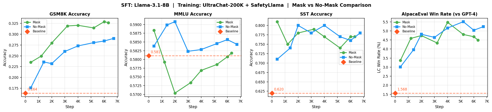

# Supervised Fine-Tuning from Scratch

This folder contains my **from-scratch implementation** of Supervised Fine-Tuning (SFT), loosely following Stanford's [CS336 Assignment 5](https://github.com/stanford-cs336/assignment5-alignment) (both main and supplementary parts). I implemented the core SFT training loop, helper functions, and evaluation pipelines, then ran two categories of experiments:

**1. Reasoning SFT**: Fine-tuned [Qwen2.5-Math-1.5B](https://huggingface.co/Qwen/Qwen2.5-Math-1.5B) on math reasoning traces (from `math12k` dataset) to improve step-by-step reasoning and problem solving:

> Best: **53.4% reward accuracy** (up from 2.9% baseline) with 99.3% format accuracy


**2. Instruction SFT**: Fine-tuned [Llama-3.1-8B](https://huggingface.co/meta-llama/Llama-3.1-8B) on UltraChat-200K + SafetyLlama for general instruction following:

> Best: GSM8K 16->**33%**, Safety 62->**78%**, AlpacaEval 1.6->**5.3%**, MMLU ~58% (no knowledge forgetting)


## Table of Contents
- [How to go through the implementation](#how-to-go-through-the-implementation)
- [Reasoning SFT](#reasoning-sft)
- [Instruction SFT](#instruction-sft)
- [Datasets and Checkpoints](#datasets-and-checkpoints)
- [Folder Structure](#folder-structure)

## How to go through the implementation

If you want to understand how I approached the implementation, I recommend exploring the commit history. Each commit represents an incremental step—setting up inference pipeline, building datasets, implementing training, running experiments, and analyzing results. 

### Commit Summary

**Phase 1: Reasoning SFT (Qwen2.5-Math-1.5B)**

| Commits | Task | Description |
|---------|------|-------------|
| `87f9f08`, `c6de361` | Setup | Init project, setup vLLM for offline inference |
| `212ee1e` -> `0f2d905` | Dataset | Train/val splits, batch infer reasoning traces, build SFT dataset |
| `159a02d`, `85dfc75` | Baseline + helpers | Baseline eval (2.9%), core SFT functions |
| `ea41a8e` | Dataset v2 | Re-generate traces with `gpt-oss-120b` |
| `d5d0e1e` -> `533efa0` | Training | Training script, wandb, vLLM eval, metrics logging |
| `7d77cdc`, `cf852c5` | Experiments | Run training runs, compare on full val set |

**Phase 2: Instruction Fine-Tuning SFT (Llama-3.1-8B)**

| Commits | Task | Description |
|---------|------|-------------|
| `7612c69` -> `b94b8d7` | Baselines | Eval data + zero-shot baselines (MMLU, GSM8K, AlpacaEval, SST) |
| `0d0cb7f` -> `b816cfa` | Training setup | Dataset class with masking, training script |
| `88df93f`, `2c03b21` | Training runs | Run no-mask and mask experiments |
| `0fd9058` -> `e2ebaab` | Evaluation | Compute metrics, plot results, unified eval script |

> For detailed per-commit breakdown, see [Detailed Commit History](Notes.md#detailed-commit-history) section in [Notes.md](Notes.md).


## Reasoning SFT
Following CS336 Assignment 5, the goal here was to fine-tune `Qwen/Qwen2.5-Math-1.5B` to improve its mathematical reasoning capabilities.

The core idea was simple take a base model that barely outputs correct answers (`2.9% baseline`), give it high-quality reasoning traces showing *how* to solve problems step-by-step, and train it to replicate that reasoning process. The model learns to think through problems in a structured format—first generating reasoning inside `<think>` tags, then outputting the final answer in `<answer>` tags.

### Dataset

Since the original CS336 MATH dataset isn't publicly available, I created my own training dataset by sourcing problems from `hiyouga/math12k` and generating reasoning traces using `gpt-oss-120b` model. 

Please refer to [Dataset Creation Pipeline](Notes.md#dataset-creation-pipeline) section in [Notes.md](Notes.md) for more details on the dataset creation pipeline.

### Training Runs

I ran a few experiments to understand what works best for reasoning SFT. All runs used [train_sft_reason.py](train_sft_reason.py) with the following base configuration.

| Parameter | Value |
|-----------|-------|
| Batch Size | 128 (2 micro × 64 grad acc. steps) |
| Learning Rate | 1e-4 |
| Loss | Per-token normalized (configurable) |
| Max Length | 2048 tokens |

**The different runs:**

| Run | Training Data | Steps | Notes |
|-----|--------------|-------|-------|
| **baseline** | — | - | Untrained Qwen2.5-Math-1.5B |
| **run_all** | Full 4.8K (correct + incorrect) | ~38 (1 epoch) | Includes wrong reasoning traces |
| **run_filtered** | Filtered 3.6K (correct only) | ~28 (1 epoch) | Removed incorrect traces |
| **run_filtered-res-len** | Filtered 3.6K | ~28 | No per-token loss normalization |
| **run_filtered-2epoch** | Filtered 3.6K | ~56 (2 epochs) | Longer training |
> All the training runs can be found in the wandb's [sft](https://wandb.ai/garg-aayush/sft) project.


**Key Takeaways:**
- Removing incorrect reasoning traces (`run_filtered` vs `run_all`) boosted accuracy from `0.4214` to `0.5204`. Training on wrong traces teaches the model wrong patterns.
- Using per-token loss normalization gave slightly better results than sequence-level loss. Without normalization, longer sequences dominate the gradient, creating high variance.
- Running the training for 2 epochs (`run_filtered-2epoch`) gave the best result at `0.5336`, though the improvement is sort of marginal.
- Based on the format accuracy metrics, the model quickly learns to use `<think>` and `<answer>` tags correctly.

> Note: I have uploaded all checkpoints and datasets to Hugging Face Hub. See the [Datasets and Checkpoints](#datasets-and-checkpoints) section for details.


## Instruction SFT

Following the [CS336 Supplementary Assignment 5](https://github.com/stanford-cs336/assignment5-alignment/blob/main/cs336_spring2025_assignment5_supplement_safety_rlhf.pdf), I fine-tuned `Llama-3.1-8B` to build a model that can follow instructions, handle diverse tasks, and refuse harmful requests.

Unlike reasoning SFT where I trained on step-by-step reasoning traces, instruction fine-tuning trains on conversational instruction-response pairs. The training data combines **UltraChat-200K** (diverse multi-turn conversations) and **SafetyLlama** (safety-focused examples) to teach the model both helpfulness and safety.

### Dataset

The training dataset was provided by the assignment: ~200K examples from UltraChat-200K + SafetyLlama, formatted using the Alpaca prompt template. Each example contains an instruction and the expected response.

For evaluation, I used four benchmarks as specified in the assignment:
- **GSM8K**: Grade-school math problems (tests reasoning)
- **MMLU**: Multiple-choice questions across 57 subjects (tests factual knowledge)
- **AlpacaEval**: Open-ended instructions judged by LLM-as-judge (tests instruction-following quality)  
- **Simple Safety Tests (SST)**: Harmful prompts to test refusal behavior (tests safety)

### Training Runs

I ran two experiments using [train_sft_instruct.py](train_sft_instruct.py) with the following configuration:

| Parameter | Value |
|-----------|-------|
| Batch Size | 32 (4 micro × 8 grad acc. steps) |
| Learning Rate | 2e-5 (cosine decay, 3% warmup) |
| Sequence Length | 512 tokens |
| Epochs | 1 (~6726 steps) |

**The two runs:**

| Run | Prompt Masking | Notes |
|-----|----------------|-------|
| **run_nomask** | No | Loss computed on all tokens (prompt + response) |
| **run_mask** | Yes | Loss computed only on response tokens (prompt masked as -100) |

> All training runs can be found in the wandb's [sft_instruct](https://wandb.ai/garg-aayush/sft_instruct) project.

### Results

| Benchmark | Baseline | No-Mask | Mask |
|-----------|----------|---------|------|
| **GSM8K** | 16.4% | 29.0% | **32.7%** |
| **MMLU** | 58.1% | 58.4% | 58.2% |
| **SST Safety** | 62.0% | **78.0%** | 77.0% |
| **AlpacaEval** | 1.57% | **5.3%** | 4.5% |



**Key Takeaways:**
- **GSM8K improved significantly** (16% -> 29-33%): The model learned structured reasoning in both the runs. Prompt masking helped more (32.7% vs 29.0%) by focusing loss on response generation helps math reasoning.
- **Safety improved as expected** (62% -> 78%): Direct result of including SafetyLlama data in training. Both masking approaches performed similarly.
- **AlpacaEval improved too** (1.6% -> 5.3%): Conversational instruction-following improved substantially, though still low due to 512-token response limit. No-mask performed slightly better (5.3% vs 4.5%) as I guess training on full sequence helps produce naturally flowing conversational responses.
- **MMLU stayed flat** (~58%): This is actually good and shows no catastrophic forgetting. MMLU tests factual knowledge from pre-training and SFT teaches *how* to respond, not *what* to know. Thus, both runs preserved pre-training knowledge equally well.

For more details on the evaluation pipeline, see [SFT Instruction Fine-Tuning Results](Notes.md#sft-instruction-finetuning-results) section in [Notes.md](Notes.md).

> Note, I have uploaded all the training runs checkpoints, train/val datasets to hugging face hub. Please refer to the [Datasets and Checkpoints](#datasets-and-checkpoints) section for more details.


## Datasets and Checkpoints
I have uploaded all training/evaluation datasets and model checkpoints to Hugging Face Hub.

### SFT Instruction finetuning
**Datasets:**
The instruction-tuning dataset is available in the [sft-instruct](https://huggingface.co/datasets/garg-aayush/sft-cs336-assign5-datasets/tree/main/sft-instruct) folder of HF's repo `sft-cs336-assign5-datasets`.
| File | Description |
|------|-------------|
| `train.jsonl` | Training dataset (~200k examples) |
| `test.jsonl` | Validation dataset for intermediate evaluation |
| `sample_train.jsonl` | 1k-example subsample for debugging |

> **Note:** If any eval data files are missing locally, download them from the [eval](https://huggingface.co/datasets/garg-aayush/sft-cs336-assign5-datasets/tree/main/sft-instruct/eval) subfolder (contains GSM8K, MMLU, Simple Safety Tests, Alpaca Eval).

**Training checkpoints:**
| Run | Checkpoint |
|-----|------------|
| With prompt masking (`run_mask`) | [garg-aayush/llama31-8b-sft-mask](https://huggingface.co/garg-aayush/llama31-8b-sft-mask) |
| Without prompt masking (`run_nomask`) | [garg-aayush/llama31-8b-sft-nomask](https://huggingface.co/garg-aayush/llama31-8b-sft-nomask) |

**Training logs** can be found in the wandb's [sft_instruct](https://wandb.ai/garg-aayush/sft_instruct) project.

### SFT Reasoning finetuning
The reasoning SFT datasets (for `Qwen/Qwen2.5-Math-1.5B`) are available in the [sft-reason](https://huggingface.co/datasets/garg-aayush/sft-cs336-assign5-datasets/tree/main/sft-reason) folder of HF's repo `sft-cs336-assign5-datasets`.

**Datasets:**
| File | Examples | Description |
|------|----------|-------------|
| `sft_gpt-oss-120b_filtered.jsonl` | 3,496 | Recommended - Contains only correct reasoning traces |
| `sft_gpt-oss-120b.jsonl` | 4,836 | Full dataset with both correct and incorrect answers |
| `val.jsonl` | ~5K | Validation set from CS336 Assignment 5 for evaluation |

> For details on how these datasets were created (batch inference pipeline, filtering, etc.), see [Notes.md](Notes.md#dataset-creation-pipeline).

**Training checkpoints:**
| Run | Checkpoint |
|-----|------------|
| Trained on full training data (`run_all`) | [garg-aayush/qwen-2.5-math-sft-all](https://huggingface.co/garg-aayush/qwen-2.5-math-sft-all) |
| Trained on filtered training data (`run_filtered`) | [garg-aayush/qwen-2.5-math-sft-filtered](https://huggingface.co/garg-aayush/qwen-2.5-math-sft-filtered) |
| Trained on filtered training data with no per-token loss normalization (`run_filtered-res-len`) | [garg-aayush/qwen-2.5-math-sft-filtered-res-len](https://huggingface.co/garg-aayush/qwen-2.5-math-sft-filtered-res-len) |
| Trained on filtered training data for 2 epochs (`run_filtered-2epoch`) | [garg-aayush/qwen-2.5-math-sft-filtered-2epoch](https://huggingface.co/garg-aayush/qwen-2.5-math-sft-filtered-2epoch) |


## Folder Structure
```
sft/
├── train_sft_instruct.py       # Instruction-tuning training
├── train_sft_reason.py         # Reasoning SFT training
├── evaluate_instruct.py        # Instruction-tuning evaluation
├── evaluate_reason.py          # Reasoning evaluation
├── results/                    # SFT experiments results
├── utils/
│   ├── dataloader.py           # SFT-Reasoning data loading fns
│   ├── drgrpo_grader.py        # SFT-Reasoning answer-grading logic
│   ├── helper_fns.py           # helper fns
│   ├── instruct_dataset.py     # SFT-Instruction finetuning dataset/dataloader class & fns
│   ├── instruct_measures.py    # SFT-Instruction finetuning eval metrics
│   └── post_train.py           # SFT helper functions
├── data/
│   ├── eval_configs/           # YAML configs for SFT-Instruction finetuning evaluation datasets
│   ├── eval_data/              # Evaluation dataset files
│   └── *.prompt                # Prompt templates for train/evals
├── play-scripts/
│   ├── eval-scripts/           # Individual SFT-Instruction finetuning evaluation scripts
│   └── plot-scripts/           # vibe-coded plotting scripts
├── Notes.md                    # Development notes
├── Readme.md                   # This file
└── requirements.txt            # Python dependencies
```