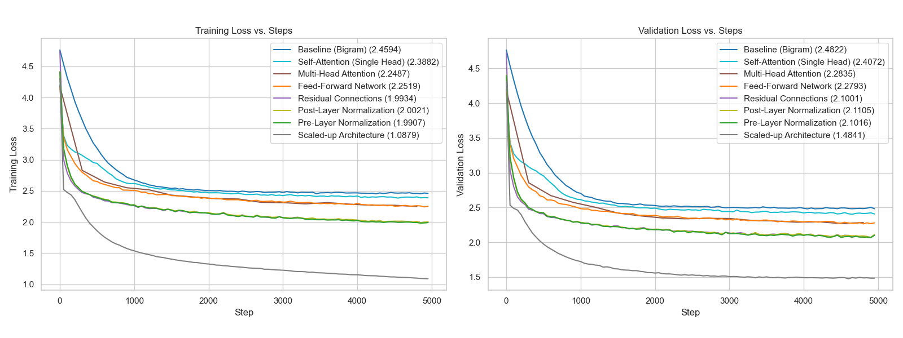

# Building Transformers from Scratch

This repository serves as a learning playground for implementing and exploring various components of the Transformer architecture from scratch or first principles, with a primary focus on GPT-style models for language modeling.

## Roadmap

- [x] Basic character-level GPT implementation
- [ ] Implement Byte-Pair Encoding (BPE)
- [ ] FlashAttention2
- [ ] Revisit GPT: Scaling, Larger Dataset, Efficiency, and Profiling
- [ ] Implement a Mixture of Experts (MoE) architecture

## Basic character-level GPT implementation

If you want to start writing a basic GPT implementation from scratch, there is no better tutorial to follow than Andrej Karpathy's tutorial **[Let's build GPT: from scratch](https://www.youtube.com/watch?v=kCc8FmEb1nY)**. I believe the best way to follow the video is to write the code line-by-line without assistant help. By the end of it, you will have learned a great deal about the inner workings and architecture of a GPT model.

As I was following the video, I tracked the training and validation loss at each step to observe how the loss decreases as we progressively add complexity to the network: attention layers, FFNs, res-connections, layer normals, and finally, scaling up.

For a detailed breakdown of the approach I followed and the notes I took during this process, please see the **[Notes.md](basic-gpt/Notes.md)** file.

