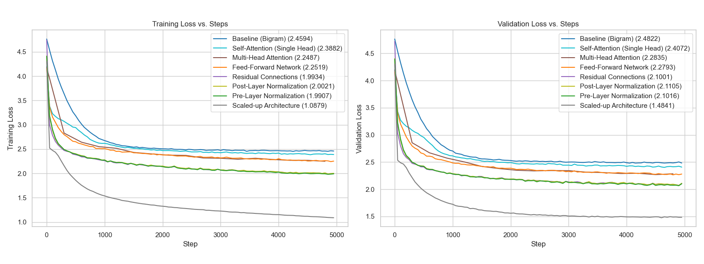

# Building GPT from Scratch: Character-Level GPT model

This folder contains my implementation of a character-level GPT model from scratch, following Andrej Karpathy's ["Let's build GPT: from scratch"](https://www.youtube.com/watch?v=kCc8FmEb1nY) video tutorial. The implementation follows a progressive approach, building up from a simple bigram model to a full Transformer architecture, tracking performance improvements at each step.



This implementation follows a systematic approach where each architectural component is added incrementally, allowing us to observe its individual impact on model performance:

| Stage | Commit | Validation Loss | Description |
|-------|--------|----------------|-------------|
| Bigram | `e0b5864` | 2.47 | Simple baseline model predicting next character |
| Self-Attention | `9b41152`, `7b0e03a` | 2.45 | Single head of self-attention |
| Multi-Head Attention | `9d2a7b5` | 2.38 | Multiple attention heads working in parallel |
| Feed-Forward Network | `c4c46ff` | 2.27 | Added computation with FFN blocks |
| Residual Connections | `0239c07` | 2.20 | Skip connections for better gradient flow |
| Post-Layer Norm | `63ef5f8` | 2.06 | Layer normalization after operations |
| Pre-Layer Norm | `4f5bef8` | 2.07 | Modern pre-normalization approach |
| Scaled-up | `d4141d7` | **1.48** | Full architecture with 6 layers, 6 heads, 384d |

- All experiments were trained on the [Tiny Shakespeare](https://raw.githubusercontent.com/karpathy/char-rnn/master/data/tinyshakespeare/input.txt) dataset (~1.1M characters)
- **You might not need any GPU to run the code. I have a macbook m3 (36GB), I was able to train all the versions on it.**

## Development Notebooks

The implementation process is documented through interactive Jupyter notebooks that explore each component:

### `bigram-dev.ipynb`
Interactive development of the baseline bigram model. Covers:
- Data loading and preprocessing
- Character-level tokenization
- Simple embedding-based prediction
- Training loop and text generation

### `self-attention-dev.ipynb`  
Deep dive into the self-attention mechanism with mathematical foundations:
- Mathematical trick for efficient attention computation
- Causal masking implementation
- Comparison of naive vs. efficient implementations
- Visualization of attention patterns

### `layer-norm-dev.ipynb`
Comparison between batch normalization and layer normalization:
- Implementation differences between batch and layer norm
- Why layer norm is preferred for sequence models
- Pre-norm vs. post-norm architectural choices

## File Structure

```
basic-gpt/
├── bigram.py                    # Complete bigram model implementation
├── gpt.py                       # Full GPT implementation (final version)
├── bigram-dev.ipynb            # Interactive bigram development
├── self-attention-dev.ipynb    # Self-attention exploration
├── layer-norm-dev.ipynb        # Normalization comparison
├── notes.md                    # Detailed notes from Karpathy's tutorial
│
├── data/
│   ├── input.txt               # Tiny Shakespeare dataset
│   └── loss_gpt_pd.csv         # Training metrics for all experiments
│
├── helper_scripts/
│   └── plot_loss.py            # Script to generate loss curve plots
│
└── images/                     # Supporting diagrams and plots
```

### Development Notebooks
- [bigram-dev.ipynb](bigram-dev.ipynb): Interactive development of baseline bigram model with tokenization and training
- [self-attention-dev.ipynb](self-attention-dev.ipynb): Mathematical exploration of self-attention mechanism and efficient implementations  
- [layer-norm-dev.ipynb](layer-norm-dev.ipynb): Comparison between batch normalization and layer normalization approaches

## Running the Code

### Prerequisites
- Python 3.8+
- PyTorch 2.0+
- Additional dependencies: `einops`, `matplotlib`, `pandas`, `seaborn`

### Quick Start
```bash
# Run the final GPT implementation
python gpt.py

# Run the simple bigram baseline  
python bigram.py

# Generate loss curves from training data
cd helper_scripts/
python plot_loss.py
```