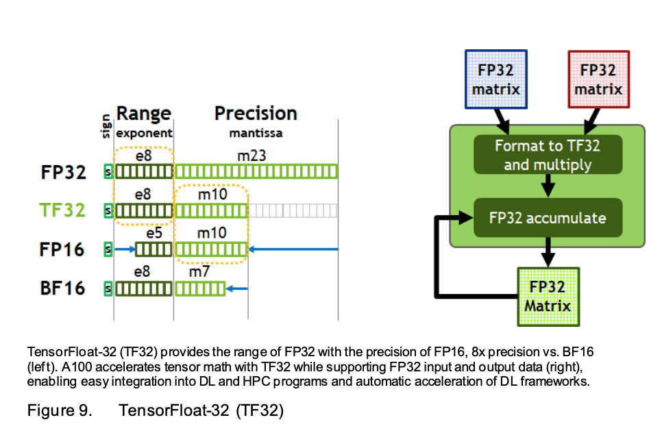
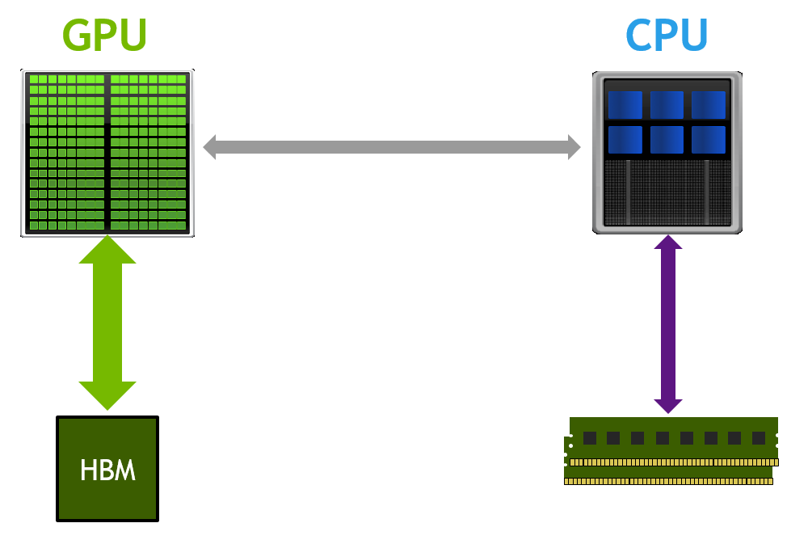
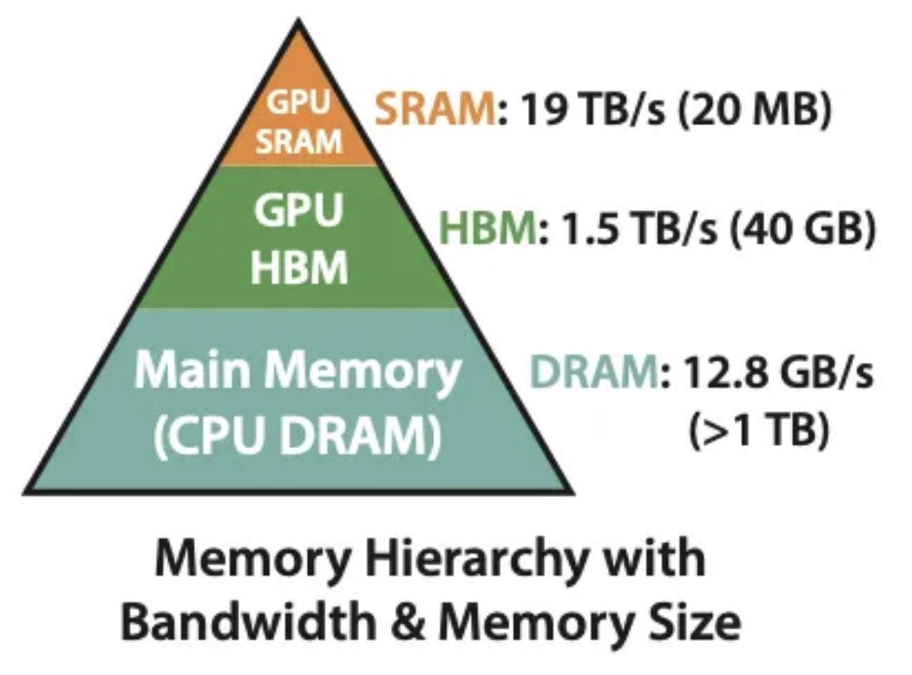
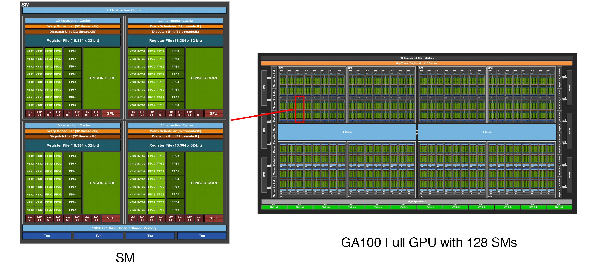

# Let's reproduce GPT-2 (124M)

## Links
- [Youtube Video Link](https://www.youtube.com/watch?v=l8pRSuU81PU&t=1388s)

## Introduction
- In this video, we reproduce the GPT-2 model, specifically the 124M parameter version.
- OpenAI released GPT-2 in 2019, along with a blog post, [research paper](https://cdn.openai.com/better-language-models/language_models_are_unsupervised_multitask_learners.pdf), and the original [TensorFlow code](https://github.com/openai/gpt-2) on GitHub.
- GPT-2 isn’t a single model but a *mini-series* of models of different sizes. The smallest has **124M** parameters, and the largest has **1.5B**. The reason for these variants is so researchers can analyze scaling laws—how model performance on tasks like translation, summarization, and Q\&A improves with size.

- GPT-2 (124M):
    * It has 12 Transformer layers.
    * Each layer has a hidden size of 768.

- If we reproduce this correctly, by the end of training we should achieve validation losses similar to the original model (good at next-token prediction on unseen validation data).

- Note, GPT-2 paper omits training details, so we’ll also reference the GPT-3 paper: [Language Models are Few-Shot Learners](https://arxiv.org/abs/2005.14165), which is more concrete about hyperparameters and optimizers.

---

## Loading the Original GPT-2 (Huggingface version)

- The original GPT-2 implementation was in TensorFlow, but we’ll use Hugging Face’s PyTorch implementation, which is easier to work with. 
- Using Hugging Face, `gpt2` corresponds to the 124M model, while larger ones use `gpt2-medium`, `gpt2-large`, and `gpt2-xl`.
- GPT-2's vocabulary has 50,257 tokens, each mapped to a 768-dimensional embedding vector. It uses learned positional embeddings of size: 768.
    - Unlike the original Transformer paper where sinusoidal embeddings were fixed, GPT-2 trains these parameters from scratch and they converge to similar patterns (sine-cosine patterns)
    - Here channels show noisy curves, suggesting the model wasn't fully trained to convergence. However, 
- Please see the [load-hf-gpt2.ipynb](load-hf-gpt2.ipynb) for more details.

---

## Building GPT-2 model class

- Instead of relying on Hugging Face’s \~2000 lines of code, we’ll write a minimal implementation (\~100 lines) with the same module/parameter structure so we can import GPT-2 weights. 
- Key architectural points difference from original _Attention_ paper :
    * Decoder-only Transformer (no encoder, no cross-attention).
    * LayerNorms moved before Attention/MLP (pre-norm).
        - Pre-norm ensures residual connections form a clean pathway from inputs to outputs, allowing gradients to flow effectively as `+` operation distributes the gradient equally across the two pathways. It is good for optimization. 
    * Extra LayerNorm before the LM head.
- You can think attention is the “reduce” operation, where tokens exchange information by attending to others, while the MLP is the “map” operation, applied independently to each token. Thus, each block can be seen as a sequence of map-reduce steps, progressively refining token representations.
- The MLP in GPT-2 uses the [GELU](https://arxiv.org/abs/1606.08415) activation function, specifically the approximate version based on `tanh`. 
    - This choice is historical—at the time, the exact GELU implementation was slower in TensorFlow, so the approximation was used and carried over into BERT and GPT-2. See this [blog](https://github.com/pytorch/pytorch/issues/39853).
    - While today we’d prefer the exact version, we’ll reproduce GPT-2 faithfully by using the approximation. 
    - GELU has advantages over ReLU since it avoids the “dead relu neuron” problem and provides smoother gradients.
        -  If a ReLU neuron is exactly flat at zero, any activations that fall there will get exactly zero gradient. There's no change, no adaptation, no development of the network.
        - The GELU always contributes a local gradient and so there's always going to be a change always going to be an adaptation and sort of smoothing it out ends up empirically working better in practice
- Multi-head attention is implemented with tensor reshaping (4D-Tensor) for efficient parallel computation.

---

## Forward Pass & Sampling

- The forward pass takes input token indices (B,T) and outputs logits (B,T,vocab_size). Applying softmax gives next-token probabilities. This is the T+1 logits.

- Sampling:
    * We start with a prefix (e.g., *“Hello, I’m a language model”*).
    * Take the model’s output logits. Apply softmax to get probabilities. This is the T+1 logits.
    * Repeatedly sample from logits using **top-k sampling (k=50)** (default in Hugging Face pipeline).
    * Top-k sampling restricts sampling to the top-k most probable tokens. This improves coherence by avoiding low-probability words that derail the text. If we sample from the full distribution, completions tend to go off track; restricting to top-k helps a lot. In top-k, it is done by creating a mask of the top-k most probable tokens and setting the rest to 0. Then, we sample from the masked renormalized distribution.
    * Append sampled tokens until max length is reached.
    
- The implementation generates coherent text, though Hugging Face’s pipeline has slight differences due to additional sampling heuristics.

---

## Dataset Choice: Tiny Shakespeare

- For debugging and quick iteration, we don’t start with a huge dataset. Instead, we use the **Tiny Shakespeare dataset**:
    * It’s small enough to train on a laptop/GPU quickly, but large enough to test whether the model learns.
    * Text is plain ASCII, so each character maps to a single byte.
- This dataset allows us to debug the training pipeline before moving to larger corpora.
- Here,
    * **Inputs (X):** the current sequence of tokens.
    * **Targets (Y):** the same sequence shifted left by one position.
---

## Loss function: cross-entropy loss

- We use **cross-entropy loss**, the standard for classification problems:
    * The logits from the model are of shape `(batch_size, sequence_length, vocab_size)`.
    * Targets are `(batch_size, sequence_length)`.
    * Cross-entropy flattens these and computes how well the predicted distribution matches the actual next token.

- At initialization, the model’s predictions are close to uniform across the 50,257 tokens.
    * Expected loss at this stage = `-ln(1/vocab_size)` ≈ **10.8**. This is the loss we expect when the model is making random predictions. This shows the model is not favoring any one token over the others. The probability of each token is fairly diffused.
    * If we see a loss near this, we know our pipeline is wired correctly. 
---

## Optimize on single set of batch
- We train using **AdamW**, a variant of the Adam optimizer that fixes weight decay behavior:
    * Make sure to start by zeroing gradients (`optimizer.zero_grad()`).
- Before training on the whole dataset, we first **train repeatedly on one tiny batch** as a sanity check.
    * If the model can drive loss close to zero, it means our implementation of forward/backward/optimizer is correct. This shows the model is learning to overfit the small batch, which is a standard sanity check in deep learning.
    * If it fails to overfit, there's a bug in the pipeline.
---

## Minimal dataloader
Next I implement a minimal **data loader**:
- Read the whole tokenized dataset once and maintain a current position
- On each `next_batch()` call:
    * Return contiguous chunks of size `B*T+1` (the +1 is for creating labels)
    * Advance position by `B*T` tokens
    * Wrap back to the start when past the end of dataset
- Running only 50 steps shows loss dropping from ~11 to ~6.6:
    * This is mostly from learning that many vocab entries (unicodes) never occur (driving their logits down). 
    * Plus some early learning signal
    * Loss won't reach zero without training for full epochs
---

## Fix the bug relative to GPT-2

There's a subtle **bug** relative to GPT-2: 
- Until now, we didn't consider the **weight tying** between input embeddings and the output classifier layers
- In GPT-2 ([Attention Is All You Need](https://arxiv.org/abs/1706.03762) following [Press & Wolf 2017](https://arxiv.org/pdf/1608.05859)), the token embedding matrix `wte.weight` and the classifier matrix used before the final softmax share **the same weights**. You can check this by comparing the state dicts `wte.weight` and `lm_head.weight`. They should be equal and point to same data pointer
- Tying has two benefits:
    * (1) It enforces that token similarity is consistent between embedding space and output distribution
    * (2) It saves parameters—here `768 × 50257 ≈ 40M` weights, \~30% of the 124M model
---

## Initialization Matching GPT-2

- We need to ensure my initialization matches GPT-2's approach:
- Initialize embedding and linear layers:
    * **Linear weights:** Initialize with `Normal(0, 0.02)` distribution
    * **Biases:** Set to 0 
    * **Embeddings:** Use `Normal(0, 0.02)`
    * **LayerNorm:** Use PyTorch defaults (`weight=1`, `bias=0`)
- GPT-2 applies special scaling to residual branch weights at initialization:
    * Scale certain residual-branch weights by `1/√N`, where `N` = number of residual additions along the depth
    * Each block has 2 residual additions (attention + MLP), so `N = 2 * n_layer`
    * **Intuition:** The residual stream repeatedly does `x ← x + contribution`. Without scaling, variance of `x` grows like `sqrt(N)`. Scaling by `1/sqrt(N)` keeps forward activations controlled.
---

## Section 2: Let's make the training fast
Now that training works, we want to speed it up significantly to get my money's worth from the hardware. 

### Understanding GPU capabilities and current precision usage
- It is essential to understand the GPU capabilities that are available to you. It helps you understand what kind of performance you can expect.

- Key questions always to ask:
    - What hardware do I have available?
    - What computational capabilities does it offer?
    - Am I fully utilizing these capabilities?

- Current Andrej setup analysis (example: A100 80 GB SXM):
    - We can check the datasheet for expected compute capabilities
    - Precision requirements for training:
        * By default in PyTorch, all tensors (activations, parameters, etc.) use float32
            - `import code; code.interact(local=locals())`
        * Each number uses 32-bit float representation, which consumes significant memory
        * For deep learning training, float32 precision is often excessive. Training can tolerate significantly lower precisions empirically
        * These GPUs support up to FP64 (useful for scientific computing), but I don't need that much precision
    - Performance gains from lower precision:
        * FP32: I can expect at most ~19.5 TFLOPS
        * TF32: Up to 8× improvement over FP32
        * FP16/BF16: Up to ~16× improvement, reaching ~312 TFLOPS
        * Ignore NVIDIA's "with sparsity" numbers since we won't use sparsity (not widely used in training today)
        * INT8: Even higher performance, but only suitable for inference, not training (uniform spacing doesn't match normal-like distributions of activations/weights during training)
    - Memory bandwidth benefits:
        * Lower precision uses fewer bits per value, making data movement easier
        * Memory bandwidth is precious - many deep learning workloads are memory-bound
        * Tensor cores often sit idle waiting for data. Even well-tuned applications might only achieve ~60% utilization
        * Reducing precision shrinks activations and weights, allowing more data in same capacity and faster movement
---

### Performance Timing Setup
- Set up an iteration timer around the optimization loop. Make sure to use `torch.cuda.synchronize()` to ensure GPU finishes before timing
- Use big enough config: B=16,T=1024 for now onwards
    - If you get out-of-memory: reduce batch size (16 → 8 → 4…)
    - Aim to max out the largest power-of-two  batch size that fits. "Nice" numbers: 8, 16, 24, 32, 48, avoid awkward sizes like 17
- With FP32 baseline (A6000 Ada): GPU is using ~35 GB, toks/s: ~21.1K, dt: ~790ms 
---

### Using Tensor Cores (TF32) for Matrix multiplications 
- Tensor Cores: Specialized hardware units/instructions on Ampere and above GPUs designed to accelerate matrix multiplications
    - Execute small 4×4 matrix multiplication operations as fundamental building blocks
    - Support multiple precision configurations (input types, accumulator precision, output formats)
    - All larger matrix operations are automatically decomposed into these efficient 4×4 operations
- TF32 (TensorFloat-32): A precision format optimized for tensor cores that balances speed and accuracy
    - Maintains FP32's dynamic range (same sign and exponent bits) while reducing precision (truncated mantissa)
    - Provides significant speedup over FP32 with minimal impact on training quality
    - Enables tensor cores to operate much faster than standard FP32 matrix operations
- Tensor cores excel at matrix multiplication, which is where most computational work happens in GPT-2 model
    - The bulk of operations occur inside `nn.Linear` layers where tensor cores can be fully utilized
    - Additions in residuals, nonlinearities, and layer norms are comparatively cheap and don't benefit from tensor cores
    - In 124M parameter transformer, the largest matrix multiply is the classifier: 768 → 50,257, which dominates tensor core usage and can help speedup the optimization
- TF32 with Tensor Cores Implementation
    - Best reference: [A100 architecture white paper](https://images.nvidia.com/aem-dam/en-zz/Solutions/data-center/nvidia-ampere-architecture-whitepaper.pdf)
    - Tensor cores leverage TF32 format to accelerate matrix operations:
        - TF32 preserves FP32's sign (1 bit) and exponent (8 bits) for dynamic range (`high` precision)
        - Crops the mantissa by truncating 13 bits internally, leaving 19 effective bits for precision
        - Tensor core instructions handle this truncation automatically during 4×4 matrix operations
        - Accumulation and final outputs remain FP32 to maintain numerical stability
    - This optimization is transparent to PyTorch code—tensor dtypes stay the same. The precision reduction has minimal impact on training quality empirically. Perfect for transformer models where matrix multiplication dominates computational cost.
- TF32 Results
    - Enable tensor cores with TF32 precision in PyTorch with a single line controlling matmul precision. **Always try to use it**. You get great speedup with almost no code changes.
    - The gap between promised and actual speedup using TF32 varies because workloads are still memory-bound. Even though tensor cores make matrix multiplies faster with TF32, you are still moving FP32 values through memory between operations
    - With TF32 `high` (A6000 Ada): GPU is using ~35 GB, toks/s: ~30.8K, dt: ~530ms 
---

### Mixed Precision Training with BF16

- BF16 vs FP16 Precision Format:
    - BF16 (BrainFloat 16) keeps FP32's sign and exponent bits but truncates the mantissa further (sign bit: 1, exponent bit: 8, mantissa bit: 7)
    - This preserves the full dynamic range while reducing precision, which is the key advantage over FP16 (sign bit: 1, exponent bit: 5, mantissa bit: 10)
    - FP16 reduces the range significantly, which historically required gradient scalers and added complexity to training. See [Automatic Mixed Precision](https://docs.pytorch.org/tutorials/recipes/recipes/amp_recipe.html#adding-gradscaler) for more details.
    - On Ampere GPUs and above, BF16 avoids gradient scaling headaches entirely
- Implementation with PyTorch `Autocast`:
    - Enable mixed precision using `torch.autocast` following PyTorch's best practices and wrap only the model forward pass and loss calculation with autocast (mixed precision only).
    - Leave the backward pass and optimizer step outside autocast (no manual `.bfloat16()` calls on tensors)
- How Mixed Precision Works:
    - With autocast enabled, activations (like logits) automatically become BF16
    - Model parameters (like `model.transformer.wte.weight`) remain in FP32 for stability
    - PyTorch intelligently selects which operations run in lower precision. Usually, matrix multiplications typically run in BF16 for speed. Numerically sensitive operations (softmax, layer norms, losses) stay in FP32 for accuracy
- With BF16 autocast (A6000 Ada): GPU VRAM: ~33.8 GB, toks/s: ~38.6K, dt: ~423ms (improvement over TF32)
    - This comes at the cost of slightly less numeric precision for better performance. However, the precision loss can be offset by training for longer if needed
---

### Using `torch.compile`
- Graph Compilation for Neural Networks:
    - `torch.compile` is effectively a compiler for neural networks. It is enabled with a single line that wraps the model with some upfront compilation cost, but with significant speedup during execution.
    - With `torch.compile` (A6000 Ada): GPU VRAM: ~22.3 GB, toks/s: ~80.0K, dt: ~204ms
- torch.compile under the hood:
    - Without compilation, the Python interpreter steps through the forward pass operation-by-operation (in sort of `eager` mode)
    - Each operation launches a separate kernel and materializes intermediate results in GPU High Bandwidth Memory (HBM). Thus, you get expensive round trips: read from HBM → on-chip caches/registers → compute → write back to HBM
    - The main speedup using `torch.compile` comes from reducing Python overhead and minimizing GPU memory read/writes. Since `torch.compile` sees the entire computational graph, it can remove Python overhead and fuse kernels, keeping data on-chip for multiple elementwise operations before a single writeback. This kernel fusion dramatically reduces expensive HBM traffic that you would otherwise experience. You can read more about it in [torch.compile tutorial](https://docs.pytorch.org/tutorials/intermediate/torch_compile_tutorial.html).

- GPU Memory Hierarchy and Performance Bottlenecks:
    

    
    
    

    
    

    
    

    - High Bandwidth Memory (HBM):
        - Large capacity (tens of GB on A100/H100) but relatively slow access
        - This is where model parameters, activations, and gradients are stored. It acts as the main memory for GPU operations. Even with ~1-2 TB/s bandwidth, accessing HBM is expensive compared to on-chip memory
    - On-Chip Memory Hierarchy (fastest to slowest):
        - We have three levels of on-chip memory: registers, L1 cache/shared memory, and L2 cache.
        - Registers: Fastest memory directly accessible by compute cores, but extremely limited capacity
        - L1 Cache/Shared Memory: Fast per-SM memory, typically 64-128 KB per SM
        - L2 Cache: Shared across all SMs, several MB capacity, faster than HBM but slower than L1
    - Performance Bottlenecks:
        - Mostly deep learning operations are limited by how fast data can move between HBM and compute units, not by computational throughput. Tensor cores can sit idle waiting for data from HBM, leading to poor utilization (often ~60% even in well-tuned applications)
        - This is where torch.compile comes in.
---

### FlashAttention: Memory-Efficient Attention

- [FlashAttention](https://arxiv.org/abs/2205.14135) is a memory-efficient attention algorithm that significantly optimizes the standard attention mechanism. While `torch.compile` provides many optimizations, it won't discover specialized algorithms like FlashAttention, which requires manual implementation
- FlashAttention Works:
    - Standard attention materializes the full T×T attention matrix in High Bandwidth Memory (HBM), which becomes extremely expensive for long sequences
    - FlashAttention restructures the computation to avoid ever storing this large attention matrix in HBM. It processes attention in chunks, never requiring the full T×T matrix to exist in memory simultaneously.The tiling strategy allows it to work within the memory constraints of GPU streaming multiprocessors. Basically, it is aware of the memory hierarchy and orchestrates the computation such that we have fewer reads and writes to the HBM.
    - Although it performs more FLOPs on paper, it drastically reduces expensive HBM reads/writes, making it substantially faster overall
    - FlashAttention is implemented as a kernel fusion operation. It uses an [online softmax](https://arxiv.org/abs/1805.02867) trick that computes attention scores in small blocks/tiles. "Online softmax" is a technique that computes the softmax in an online manner, without having to store all the inputs in memory simultaneously using intermediate variables.
- With `FlashAttention` (A6000 Ada): GPU VRAM: ~13.1 GB, toks/s: ~104.5K, dt: ~155ms
---

### Using "nice" numbers
- Choosing "nice" numbers (powers of 2) is crucial for CUDA kernel efficiency
    - CUDA kernels are optimized around powers of two dimensions (16, 32, 64, 128, 256, 512, 1024...)
    - "Ugly" dimensions like 50,257 force inefficient boundary conditions in CUDA kernels
- With "nice" numbers (A6000 Ada): GPU VRAM: ~13.1 GB, toks/s: ~107.5K, dt: ~152ms (Marginal improvement)